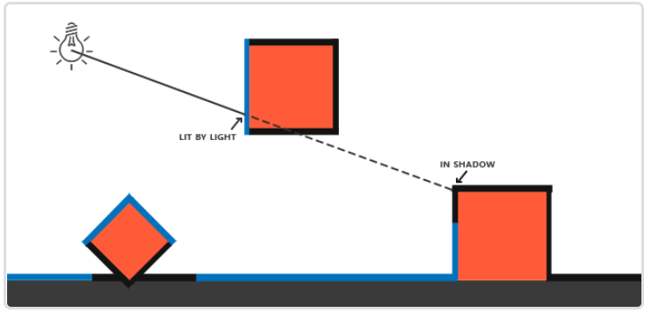
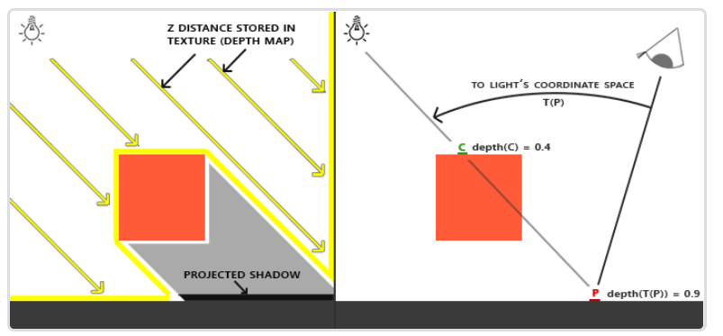
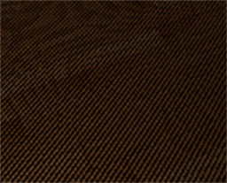
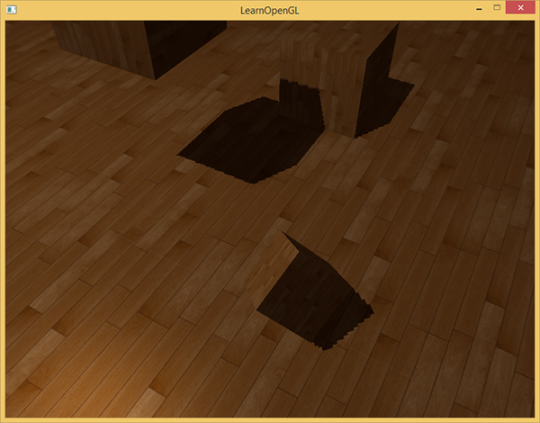
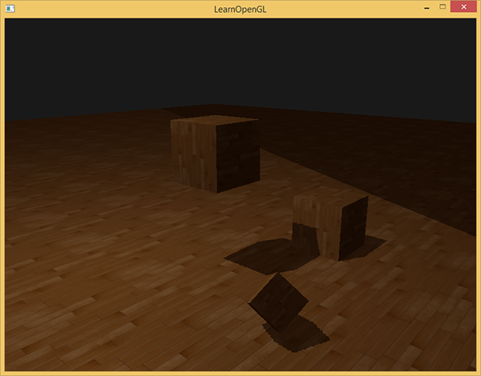
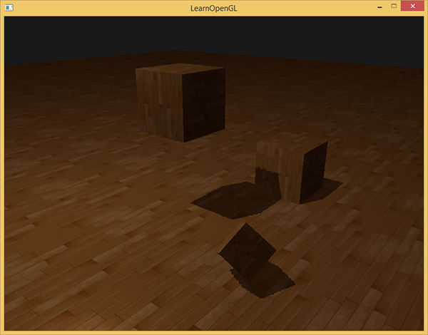
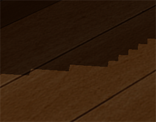
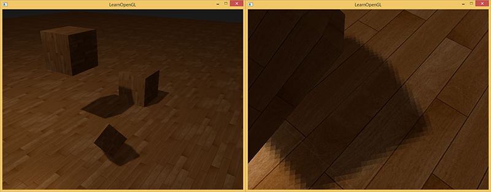
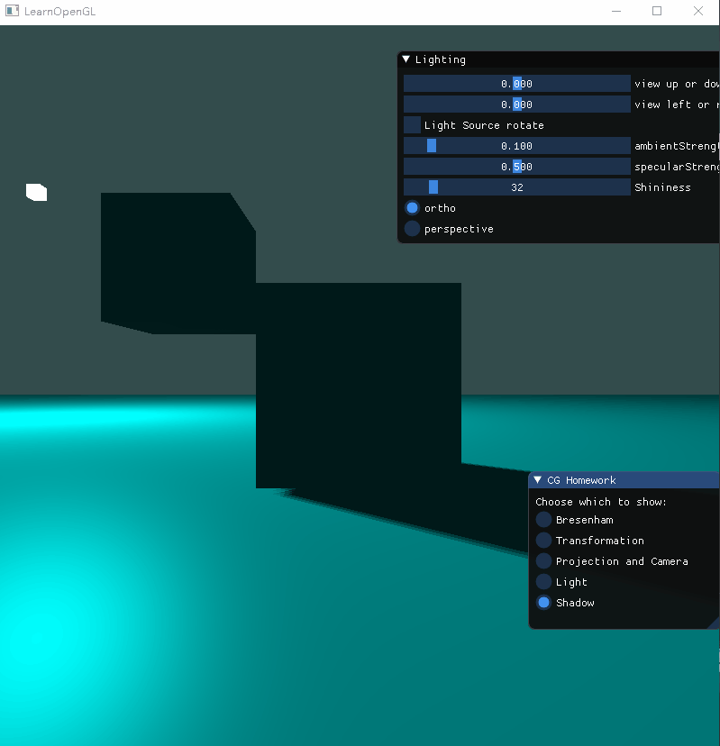

## 计算机图形学 | hw7

### 一、理论基础

#### 阴影映射

阴影映射(Shadow Mapping)背后的思路非常简单：我们以光的位置为视角进行渲染，我们能看到的东西都将被点亮，看不见的一定是在阴影之中了。假设有一个地板，在光源和它之间有一个大盒子。由于光源处向光线方向看去，可以看到这个盒子，但看不到地板的一部分，这部分就应该在阴影中了。遍历从光源发出的射线上的点是十分消耗性能的事情，因此我们将离光源最近的点的深度值保存到纹理中，最终对深度值进行采样。



通过跟深度纹理中的深度值进行比较，可以迅速在渲染物体表面时确定该片元是否在阴影中。



### 二、 实验过程

#### 1. 深度贴图

深度贴图是从光的透视图里渲染的深度纹理，用它计算阴影。因为我们需要将场景的渲染结果储存到一个纹理中，我们将再次需要帧缓冲，创建一个2D纹理，并且把生成的深度纹理作为帧缓冲的深度缓冲。

```c++
GLuint depthMapFBO;
glGenFramebuffers(1, &depthMapFBO);

const GLuint SHADOW_WIDTH = 1024, SHADOW_HEIGHT = 1024;

GLuint depthMap;
glGenTextures(1, &depthMap);
glBindTexture(GL_TEXTURE_2D, depthMap);
glTexImage2D(GL_TEXTURE_2D, 0, GL_DEPTH_COMPONENT, 
             SHADOW_WIDTH, SHADOW_HEIGHT, 0, GL_DEPTH_COMPONENT, GL_FLOAT, NULL);
glTexParameteri(GL_TEXTURE_2D, GL_TEXTURE_MIN_FILTER, GL_NEAREST);
glTexParameteri(GL_TEXTURE_2D, GL_TEXTURE_MAG_FILTER, GL_NEAREST);
glTexParameteri(GL_TEXTURE_2D, GL_TEXTURE_WRAP_S, GL_REPEAT); 
glTexParameteri(GL_TEXTURE_2D, GL_TEXTURE_WRAP_T, GL_REPEAT);

glBindFramebuffer(GL_FRAMEBUFFER, depthMapFBO);
glFramebufferTexture2D(GL_FRAMEBUFFER, GL_DEPTH_ATTACHMENT, GL_TEXTURE_2D, depthMap, 0);
glDrawBuffer(GL_NONE);
glReadBuffer(GL_NONE);
glBindFramebuffer(GL_FRAMEBUFFER, 0);
```

#### 2. 渲染阶段和光源空间的交换

渲染分为两次，首先是渲染深度贴图，然后是将携带深度贴图一起进行正常的场景渲染。我们需要改变视口（viewport）的参数以适应阴影贴图的尺寸，如果我们忘了更新视口参数，最后的深度贴图要么太小要么就不完整。

在渲染贴图的时候，需要计算从光源出发的深度值，这里使用了正交投影。使用了lookat函数，从光源位置看向场景的中央，最后计算出一个转换到光源空间的矩阵，它将每个世界空间坐标变换到光源处所见到的那个空间，因此我们可以计算出深度值。

```c++
glm::mat4 model = glm::mat4(1.0f);
glm::mat4 view = glm::mat4(1.0f);
glm::mat4 projection = glm::mat4(1.0f);

model = glm::translate(model, lightPos);
model = glm::scale(model, glm::vec3(0.2f));

view = camera.GetViewMatrix();
projection = glm::perspective(glm::radians(scroll_fov), (float)width / (float)height, 0.1f, 100.0f);

//-- 从光源视角渲染保存深度值
glm::mat4 lightProjection, lightView;
glm::mat4 lightSpaceMatrix;
GLfloat near_plane = 1.0f, far_plane = 10.f;
lightProjection = glm::ortho(-10.0f, 10.0f, -10.0f, 10.0f, near_plane, far_plane);
//lightProjection = glm::perspective(glm::radians(45.0f), (float)width / (float)height, 0.5f, 200.0f);
lightView = glm::lookAt(lightPos, glm::vec3(0.0f), glm::vec3(0.0, 1.0, 0.0));
lightSpaceMatrix = lightProjection * lightView;
depthShader.use();
depthShader.setMat4("lightSpaceMatrix", lightSpaceMatrix);

glViewport(0, 0, width, height);
glBindFramebuffer(GL_FRAMEBUFFER, depthMapFBO);
glClear(GL_DEPTH_BUFFER_BIT);
renderScene(depthShader);
glBindFramebuffer(GL_FRAMEBUFFER, 0);

//-- 正常渲染，携带深度信息
glViewport(0, 0, width, height);
glClear(GL_COLOR_BUFFER_BIT | GL_DEPTH_BUFFER_BIT);

shader.use();
shader.setMat4("view", view);
shader.setMat4("projection", projection);

shader.setFloat("ambientStrength", ambientStrength);
shader.setFloat("specularStrength", specularStrength);
shader.setInt("Shininess", Shininess);

shader.setVec3("lightPos", lightPos);
shader.setVec3("lightColor", lightColor);
shader.setVec3("objectColor", objectColor);
shader.setVec3("viewPos", camera.getPostion());
shader.setMat4("lightSpaceMatrix", lightSpaceMatrix);

glActiveTexture(GL_TEXTURE0);
glBindTexture(GL_TEXTURE_2D, depthMap);
renderScene(shader);

//-- 光源绘制
lightShader.use();
lightShader.setMat4("model", model);
lightShader.setMat4("view", view);
lightShader.setMat4("projection", projection);

glBindVertexArray(cubeVAO);
glDrawArrays(GL_TRIANGLES, 0, 36);
glBindVertexArray(0);
```

#### 3. 渲染深度值和深度着色器

第一阶段渲染的时候需要重新定义专门用于深度值的着色器，因为只需要将深度值渲染到深度贴图中，因此顶点着色器只需要将世界坐标下的顶点转换到光源空间即可。

```
#version 330 core
layout (location = 0) in vec3 position;

uniform mat4 lightSpaceMatrix;
uniform mat4 model;

void main()
{
    gl_Position = lightSpaceMatrix * model * vec4(position, 1.0f);
}
```

片段着色器不需要做任何操作，深度缓冲会被更新。

```
#version 330 core

void main()
{             
    // gl_FragDepth = gl_FragCoord.z;
}
```

#### 4. 渲染阴影

在第二阶段渲染正常的场景的时候，我们依旧使用冯氏光照模型。

顶点着色器输出了`FragPosLightSpace`，很显然是将世界坐标转换为了光源空间坐标。

```
#version 330 core
layout(location = 0) in vec3 aPos;
layout(location = 1) in vec3 aNormal;

out vec3 Normal;
out vec3 FragPos;
out vec4 FragPosLightSpace;

uniform mat4 lightSpaceMatrix;
uniform mat4 model;
uniform mat4 view;
uniform mat4 projection;

void main()
{
	gl_Position = projection * view * model * vec4(aPos, 1.0);
	Normal = mat3(transpose(inverse(model))) * aNormal;
	FragPos = vec3(model * vec4(aPos, 1.0));
	FragPosLightSpace = lightSpaceMatrix * vec4(FragPos, 1.0);
}
```

片段着色器需要计算shadow值，当fragment在阴影中时是1.0，在阴影外是0.0。然后，diffuse和specular颜色会乘以这个阴影元素。由于阴影不会是全黑的（由于散射），我们把ambient分量从乘法中剔除。计算shadow值的时候首先进行透视触除法吗，片元如果在光空间中会返回-1到1，因为深度贴图的深度在0到1之间，因此在深度贴图中采样projCoords也进行变换。最后通过片元当前的深度与深度贴图中的深度值进行比较，判断片元是否被物体遮掩，即判断片元是否在阴影中。

```
#version 330 core
out vec4 FragColor;

in vec3 Normal;
in vec3 FragPos;
in vec4 FragPosLightSpace;

uniform sampler2D shadowMap;

uniform float ambientStrength;
uniform vec3 lightPos; 
uniform vec3 lightColor;
uniform vec3 objectColor;
uniform vec3 viewPos;
uniform int Shininess;
uniform float specularStrength;

float ShadowCalculation(vec4 fragPosLightSpace)
{
    // 透视除法
    vec3 projCoords = fragPosLightSpace.xyz / fragPosLightSpace.w;
    // 归一化
    projCoords = projCoords * 0.5 + 0.5;
    // 获取最近点深度
    float closestDepth = texture(shadowMap, projCoords.xy).r; 
    // 当前片元深度
    float currentDepth = projCoords.z;
    // 计算阴影
	vec3 lightDir = normalize(lightPos - FragPos);
	float bias = max(0.05 * (1.0 - dot(normalize(Normal), lightDir)), 0.025);
    float shadow = 0.0;
    vec2 texelSize = 1.0 / textureSize(shadowMap, 0);
    for(int x = -1; x <= 1; ++x)
    {
        for(int y = -1; y <= 1; ++y)
        {
            float pcfDepth = texture(shadowMap, projCoords.xy + vec2(x, y) * texelSize).r; 
            shadow += currentDepth - bias > pcfDepth  ? 1.0 : 0.0;        
        }    
    }
    shadow /= 9.0;

    if(projCoords.z > 1.0)
        shadow = 0.0;

    return shadow;
}

void main()
{
	// ambient
	vec3 ambient = ambientStrength * lightColor;
    // diffuse
	vec3 norm = normalize(Normal);
	vec3 lightDir = normalize(lightPos - FragPos);
	float diff = max(dot(norm, lightDir), 0.0);
	vec3 diffuse = diff * lightColor;
	// specular
	vec3 viewDir = normalize(viewPos - FragPos);
    vec3 reflectDir = reflect(-lightDir, norm);  
    float spec = pow(max(dot(viewDir, reflectDir), 0.0), Shininess);
    vec3 specular = specularStrength * spec * lightColor;  
	// shadow
	float shadow = ShadowCalculation(FragPosLightSpace);       
    vec3 result = (ambient + (1.0 - shadow) * (diffuse + specular)) * objectColor; 

	FragColor = vec4(result, 1.0);
}
```

#### 5. 阴影失真

前面的图片中明显有不对的地方。放大看会发现明显的线条样式：



我们可以看到地板四边形渲染出很大一块交替黑线。这种阴影贴图的不真实感叫做**阴影失真(Shadow Acne)**，下图解释了成因：


因为阴影贴图受限于解析度，在距离光源比较远的情况下，多个片元可能从深度贴图的同一个值中去采样（比如分辨率为1024，也就只采1024个点，在一定范围内点都取同一个深度值）。图片每个斜坡代表深度贴图一个单独的纹理像素。你可以看到，多个片元从同一个深度值进行采样。可以用一个叫做**阴影偏移**（shadow bias）的技巧来解决这个问题，我们简单的对表面的深度（或深度贴图）应用一个偏移量，这样片元就不会被错误地认为在表面之下了。


使用了偏移量后，所有采样点都获得了比表面深度更小的深度值，这样整个表面就正确地被照亮，没有任何阴影。我们可以这样实现这个偏移：

```
float bias = 0.005;
float shadow = currentDepth - bias > closestDepth  ? 1.0 : 0.0;
```

一个0.005的偏移就能帮到很大的忙，但是有些表面坡度很大，仍然会产生阴影失真。有一个更加可靠的办法能够根据表面朝向光线的角度更改偏移量：使用点乘：

```
float bias = max(0.05 * (1.0 - dot(normal, lightDir)), 0.005);
```

这里我们有一个偏移量的最大值0.05，和一个最小值0.005，它们是基于表面法线和光照方向的。这样像地板这样的表面几乎与光源垂直，得到的偏移就很小，而比如立方体的侧面这种表面得到的偏移就更大。下图展示了同一个场景，但使用了阴影偏移，效果的确更好：



选用正确的偏移数值，在不同的场景中需要一些像这样的轻微调校，但大多情况下，实际上就是增加偏移量直到所有失真都被移除的问题。

#### 6. 悬浮

悬浮此次没有显示出来，因为实现出来效果不太好，猜想应该是光源位置的问题吧。

使用阴影偏移的一个缺点是你对物体的实际深度应用了平移。偏移有可能足够大，以至于可以看出阴影相对实际物体位置的偏移，你可以从下图看到这个现象（这是一个夸张的偏移值）：


这个阴影失真叫做悬浮(Peter Panning)，因为物体看起来轻轻悬浮在表面之上（译注Peter Pan就是童话彼得潘，而panning有平移、悬浮之意，而且彼得潘是个会飞的男孩…）。我们可以使用一个叫技巧解决大部分的Peter panning问题：当渲染深度贴图时候使用正面剔除（front face culling）你也许记得在面剔除教程中OpenGL默认是背面剔除。我们要告诉OpenGL我们要剔除正面。

因为我们只需要深度贴图的深度值，对于实体物体无论我们用它们的正面还是背面都没问题。使用背面深度不会有错误，因为阴影在物体内部有错误我们也看不见。


为了修复peter游移，我们要进行正面剔除，先必须开启GL_CULL_FACE：

```
glCullFace(GL_FRONT);
RenderSceneToDepthMap();
glCullFace(GL_BACK); // 不要忘记设回原先的culling face
```

这十分有效地解决了peter panning的问题，但只针对实体物体，内部不会对外开口。我们的场景中，在立方体上工作的很好，但在地板上无效，因为正面剔除完全移除了地板。地面是一个单独的平面，不会被完全剔除。如果有人打算使用这个技巧解决peter panning必须考虑到只有剔除物体的正面才有意义。

另一个要考虑到的地方是接近阴影的物体仍然会出现不正确的效果。必须考虑到何时使用正面剔除对物体才有意义。不过使用普通的偏移值通常就能避免peter panning。

#### 7. 采样过多


因为使用的投影都有远平面，超出该区域就会成为阴影，因为我们把深度贴图的环绕方式设置成了GL_REPEAT，因此这个无阴影区域实际上代表了深度贴图的大小。我们需要将超出范围的所有深度值都变为1，这样这些范围内的区域就不会被判断在阴影中。我们可以储存一个边框颜色，然后把深度贴图的纹理环绕选项设置为GL_CLAMP_TO_BORDER：

```
glTexParameteri(GL_TEXTURE_2D, GL_TEXTURE_WRAP_S, GL_CLAMP_TO_BORDER);
glTexParameteri(GL_TEXTURE_2D, GL_TEXTURE_WRAP_T, GL_CLAMP_TO_BORDER);
GLfloat borderColor[] = { 1.0, 1.0, 1.0, 1.0 };
glTexParameterfv(GL_TEXTURE_2D, GL_TEXTURE_BORDER_COLOR, borderColor);
```

现在如果我们采样深度贴图0到1坐标范围以外的区域，纹理函数总会返回一个1.0的深度值，阴影值为0.0。结果看起来会更真实：



仍有一部分是黑暗区域。那里的坐标超出了光的正交视锥的远平面。你可以看到这片黑色区域总是出现在光源视锥的极远处。当一个点比光的远平面还要远时，它的投影坐标的z坐标大于1.0。这种情况下，GL_CLAMP_TO_BORDER环绕方式不起作用，因为我们把坐标的z元素和深度贴图的值进行了对比；它总是为大于1.0的z返回true。

解决这个问题也很简单，只要投影向量的z坐标大于1.0，我们就把shadow的值强制设为0.0：

```
float ShadowCalculation(vec4 fragPosLightSpace)
{
    [...]
    if(projCoords.z > 1.0)
        shadow = 0.0;

    return shadow;
}
```

检查远平面，并将深度贴图限制为一个手工指定的边界颜色，就能解决深度贴图采样超出的问题，我们最终会得到下面我们所追求的效果：



这些结果意味着，只有在深度贴图范围以内的被投影的fragment坐标才有阴影，所以任何超出范围的都将会没有阴影。由于在游戏中通常这只发生在远处，就会比我们之前的那个明显的黑色区域效果更真实。

#### 8. 锯齿化消除

由于阴影映射对分辨率的过度依赖，可以看到图中会出现锯齿化的现象。因为深度贴图有一个固定的解析度，多个片元对应于一个纹理像素。结果就是多个片元会从深度贴图的同一个深度值进行采样，这几个片元便得到的是同一个阴影，这就会产生锯齿边。



锯齿化消除有两种方法：

* 通过增加深度贴图解析度的方式来降低锯齿块，也可以尝试尽可能的让光的视锥接近场景。

* PCF（percentage-closer filtering），这是一种多个不同过滤方式的组合，它产生柔和阴影，使它们出现更少的锯齿块和硬边。核心思想是从深度贴图中多次采样，每一次采样的纹理坐标都稍有不同。每个独立的样本可能在也可能不再阴影中。所有的次生结果接着结合在一起，进行平均化，我们就得到了柔和阴影。

  一个简单的PCF的实现是简单的从纹理像素四周对深度贴图采样，然后把结果平均起来：

  ```
  float shadow = 0.0;
  vec2 texelSize = 1.0 / textureSize(shadowMap, 0);
  for(int x = -1; x <= 1; ++x)
  {
      for(int y = -1; y <= 1; ++y)
      {
          float pcfDepth = texture(shadowMap, projCoords.xy + vec2(x, y) * texelSize).r; 
          shadow += currentDepth - bias > pcfDepth ? 1.0 : 0.0;        
      }    
  }
  shadow /= 9.0;
  ```



从稍微远一点的距离看去，阴影效果好多了，也不那么生硬了。如果你放大，仍会看到阴影贴图解析度的不真实感，但通常对于大多数应用来说效果已经很好了。

### 三、实验效果

正交



透视


