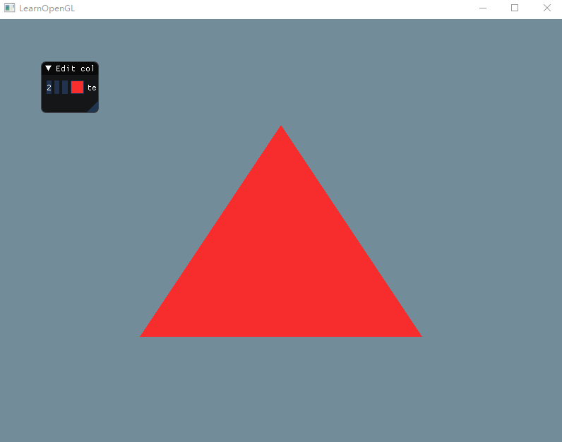

## 计算机图形学 | hw2

关于OpenGL入门以及GLFW，GLAD构建工程可以参考本人的另外一篇[博客](https://blog.cookieschen.cn/2019/03/06/opengl%E5%85%A5%E9%97%A8/)。

[github](https://github.com/CookiesChen/CG)

**一、使用OpenGL(3.3及以上)+GLFW或freeglut画一个简单的三角形。**

基本步骤有：

1. GLFW初始化和窗口创建：

   初始化时，将GLFW的版本配置为3.3(与OpenGL版本一致)，OpenGL模式设置成核心模式。

   创建窗口的时候定义好窗口的长宽和标题，最后将窗口绑定到OpenGL上下文，并且设置窗口大小改变监听器。

   ```c++
   const unsigned int WIDTH = 800;
   const unsigned int HEIGHT = 600;
   // GLFW初始化
   glfwInit();
   glfwWindowHint(GLFW_CONTEXT_VERSION_MAJOR, 3);
   glfwWindowHint(GLFW_CONTEXT_VERSION_MINOR, 3);
   glfwWindowHint(GLFW_OPENGL_PROFILE, GLFW_OPENGL_CORE_PROFILE);
   
   // GLFW窗口创建
   GLFWwindow* window = glfwCreateWindow(WIDTH, HEIGHT, "LearnOpenGL", NULL, NULL);
   if (window == NULL)
   {
       std::cout << "创建窗口失败" << std::endl;
       glfwTerminate();
       return -1;
   }
   glfwMakeContextCurrent(window);
   glfwSetFramebufferSizeCallback(window, framebuffer_size_callback);
   ```

2. GLAD指针管理

   ```c++
   // GLAD指针管理
   if (!gladLoadGLLoader((GLADloadproc)glfwGetProcAddress))
   {
       std::cout << "初始化GLAD失败" << std::endl;
       return -1;
   }
   ```

3. 编程、编译和链接着色器

   这里我们需要操作两个着色器，顶点着色器和片段着色器，首先定义GLSL源码。

   然后创建着色器，并且将源码载入着色器，编译并检测着色器。

   最后链接并检测着色器。

   ```c++
   // GLSL源码
   const char *vertexShaderSource = 
   	"#version 330 core\n"
   	"layout (location = 0) in vec3 aPos;\n"
   	"void main()\n"
   	"{\n"
   	"   gl_Position = vec4(aPos.x, aPos.y, aPos.z, 1.0);\n"
   	"}\0";
   
   const char* fragmentShaderSource = 
   	"#version 330 core\n"
   	"out vec4 FragColor;\n"
   	"void main()\n"
   	"{\n"
   	"   FragColor = vec4(1.0f, 0.3f, 0.2f, 1.0f);\n"
   	"}\n\0";
   
   // 顶点着色器
   int vertexShader = glCreateShader(GL_VERTEX_SHADER);
   glShaderSource(vertexShader, 1, &vertexShaderSource, NULL);
   glCompileShader(vertexShader);
   // 着色器编译检测
   int success;
   char infoLog[512];
   glGetShaderiv(vertexShader, GL_COMPILE_STATUS, &success);
   if (!success)
   {
       glGetShaderInfoLog(vertexShader, 512, NULL, infoLog);
       std::cout << "编译顶点着色器发生错误:\n" << infoLog << std::endl;
   }
   // 片段着色器
   int fragmentShader = glCreateShader(GL_FRAGMENT_SHADER);
   glShaderSource(fragmentShader, 1, &fragmentShaderSource, NULL);
   glCompileShader(fragmentShader);
   // 着色器编译检测
   glGetShaderiv(fragmentShader, GL_COMPILE_STATUS, &success);
   if (!success)
   {
       glGetShaderInfoLog(fragmentShader, 512, NULL, infoLog);
       std::cout << "编译片段着色器发生错误:\n" << infoLog << std::endl;
   }
   // 链接着色器
   int shaderProgram = glCreateProgram();
   glAttachShader(shaderProgram, vertexShader);
   glAttachShader(shaderProgram, fragmentShader);
   glLinkProgram(shaderProgram);
   // 链接检测
   glGetProgramiv(shaderProgram, GL_LINK_STATUS, &success);
   if (!success) {
       glGetProgramInfoLog(shaderProgram, 512, NULL, infoLog);
       std::cout << "ERROR::SHADER::PROGRAM::LINKING_FAILED\n" << infoLog << std::endl;
   }
   ```

4. 输入顶点数据，创建VAO和VBO。

   VAO和VBO的区别，VAO可以看成容器，存储不同的顶点数据和属性配置。而VBO是顶点数据的缓存。VAO可与把VBO所有的设置存储在一个对象中，每次绘制时，不需要再重新绑定顶点信息，只需要绑定VAO即可。

   ```c++
   // 输入数据
   float vertices[] = {
       -0.5f, -0.5f, 0.0f,
       0.5f, -0.5f, 0.0f,
       0.0f,  0.5f, 0.0f
   };
   
   // VAO
   unsigned int VAO;
   glGenVertexArrays(1, &VAO);
   glBindVertexArray(VAO);
   
   // VBO
   unsigned int VBO;
   glGenBuffers(1, &VBO);
   glBindBuffer(GL_ARRAY_BUFFER, VBO);
   glBufferData(GL_ARRAY_BUFFER, sizeof(vertices), vertices, GL_STATIC_DRAW);
   
   glVertexAttribPointer(0, 3, GL_FLOAT, GL_FALSE, 3 * sizeof(float), (void*)0);
   glEnableVertexAttribArray(0);
   ```

5. 渲染循环

   ```c++
   // 渲染循环
   while (!glfwWindowShouldClose(window))
   {
       // 处理输入
       processInput(window);
   
       glClearColor(0.2f, 0.3f, 0.3f, 1.0f);
       glClear(GL_COLOR_BUFFER_BIT);
   
       glUseProgram(shaderProgram);
       glDrawArrays(GL_TRIANGLES, 0, 3);
   
       glfwSwapBuffers(window);
       glfwPollEvents();
   }
   ```

运行截图：


**二、 对三角形的三个顶点分别改为红绿蓝，像下面这样。并解释为什么会出现这样的结果。**

更改三个顶点颜色步骤如下：

1. 改变输入数据，为每个顶点添加颜色数据。

   ```c++
   // 输入数据
   float vertices[] = {
       -0.5f, -0.5f, 0.0f, 1.0f, 0.0f, 0.0f,
       0.5f, -0.5f, 0.0f, 0.0f, 1.0f, 0.0f,
       0.0f,  0.5f, 0.0f, 0.0f, 0.0f, 1.0f
   };
   ```

2. 输入数据后，顶点的数据排布如下。

   

   因此VBO读取数据时需要处理颜色属性和位置属性。

   ```c++
   // 位置
   glVertexAttribPointer(0, 3, GL_FLOAT, GL_FALSE, 6 * sizeof(float), (void*)0);
   glEnableVertexAttribArray(0);
   // 颜色
   glVertexAttribPointer(1, 3, GL_FLOAT, GL_FALSE, 6 * sizeof(float), (void*)(3 * sizeof(float)));
   glEnableVertexAttribArray(1);
   ```

   顶点着色器需要添加输入值并且将输入值传递给片段着色器，源代码更改如下。

   ```c++
   const char* vertexShaderSource = 
   	"#version 330 core\n"
   	"layout (location = 0) in vec3 aPos;\n"
   	"layout (location = 1) in vec3 inColor;\n"
   	"out vec3 fColor;\n"
   	"void main()\n"
   	"{\n"
   	"   gl_Position = vec4(aPos, 1.0);\n"
   	"   fColor = inColor;\n"
   	"}\n\0";
   ```

   同理片段着色器也需要添加输入值

   ```c++
   const char* fragmentShaderSource = 
   	"#version 330 core\n"
   	"in vec3 fColor;\n"
   	"out vec4 FragColor;\n"
   	"void main()\n"
   	"{\n"
   	"   FragColor = vec4(fColor, 1.0);\n"
   	"}\n\0";
   
   ```

运行截图：


**结果分析：**

上图并不是只在顶点处渲染了颜色，而是呈线性的渲染了这个三角形。因为片段着色器进行了片段插值，光栅化阶段将根据片段的位置，插值所有的片段着色的输出变量。该插值方法根据所在位置与顶点间的距离计算出到颜色。

**三、给上述工作添加一个GUI，里面有一个菜单栏，使得可以选择并改变三角形的颜色。**

github上拉取[imgui](https://github.com/ocornut/imgui/tree/master/docs)源代码之后，在example文件夹中找到相应的文件夹，引入文件并且按照如下代码结构将源代码嵌入到项目中。


完成库引用之后，需要修改`imgui_impl_opengl3.cpp`中的一个宏，因为我们使用的是glad进行指针管理。


接下来就是使用imgui了。首先初始化imgui和一些参数的设置。

```c++
// imgui初始化
const char* glsl_version = "#version 330";
IMGUI_CHECKVERSION();
ImGui::CreateContext();
ImGuiIO& io = ImGui::GetIO();(void)io;
ImGui::StyleColorsDark();
ImGui_ImplGlfw_InitForOpenGL(window, true);
ImGui_ImplOpenGL3_Init(glsl_version);

ImVec4 clear_color = ImVec4(0.45f, 0.55f, 0.60f, 1.00f);
ImVec4 tran_color = ImVec4(0.10f, 0.10f, 0.10f, 1.00f);// 三角形颜色

```

在输入数据的时候需要将三角形的颜色进行更新。

```c++
// 输入数据
float vertices[] = {
    -0.5f, -0.5f, 0.0f, tran_color.x, tran_color.y, tran_color.z,
    0.5f, -0.5f, 0.0f, tran_color.x, tran_color.y, tran_color.z,
    0.0f,  0.5f, 0.0f, tran_color.x, tran_color.y, tran_color.z
};

```

创建imgui框架。

```c++
// Imgui框架
ImGui_ImplOpenGL3_NewFrame();
ImGui_ImplGlfw_NewFrame();
ImGui::NewFrame();

```

接下来就是自定义的布局，在这里只是简单的使用了颜色编辑器，将刚刚初始化的三角形颜色绑定到颜色编辑器上。

```c++
// 自定义布局
ImGui::Begin("Edit color");
ImGui::ColorEdit3("test", (float*)& tran_color);
ImGui::End();

```

最后就是imgui渲染。

```c++
// Imgui渲染
ImGui::Render();
ImGui_ImplOpenGL3_RenderDrawData(ImGui::GetDrawData());

```

**运行截图**



**BONUS**

**1. 绘制其他的图元，除了三角形，还有点、线等。**

只需要在`glDrawElements`的时候将绘制类型从 `GL_TRIANGLES` 改为 `GL_LINES` 就可以实现划线。

运行截图：


**2. 使用EBO(Element Buffer Object)绘制多个三角形。**

EBO使用还是比较简单的，首先重写输入数据，定义四个顶点，然后引入索引，将索引数据缓存进EBO中，最后通过调用`glDrawElements`进行绘制。

```c++
// 输入数据
float vertices[] = {
    -0.5f,  0.0f, 0.0f, 0.5f, 0.5f, 0.5f,
    0.5f,  0.0f, 0.0f, 0.5f, 0.5f, 0.5f,
    0.0f, -0.5f, 0.0f, tran_color.x, tran_color.y, tran_color.z,
    0.0f,  0.5f, 0.0f, 0.5f, 0.5f, 0.5f
};
unsigned int indices[] = {  // note that we start from 0!
    0, 1, 2,  // first Triangle
    0, 1, 3   // second Triangle
};

...
    
// EBO
glBindBuffer(GL_ELEMENT_ARRAY_BUFFER, EBO);
glBufferData(GL_ELEMENT_ARRAY_BUFFER, sizeof(indices), indices, GL_STATIC_DRAW);

...
    
glDrawElements(GL_TRIANGLES, 6, GL_UNSIGNED_INT, 0);

```

运行截图：

