# 计算机图形学 | hw3

[github](https://github.com/CookiesChen/CG)

## 前言

输入说明与文件结构说明。

### 输入说明

因为下面的题目需要使用到整型的数据，因此在输入的时候，将标准坐标都扩大了100倍数，因此在计算出最终要输出的结点时，需要除以100，从而将点的坐标换算回标准坐标，这样就可以避免过多的浮点数运算。

### 文件结构说明

这次重构了一下代码，主要就是将操作VAO、VBO和EBO的代码移出了循环，然后封装了Bresenham类，用于这次实验。文件结构截图如下。

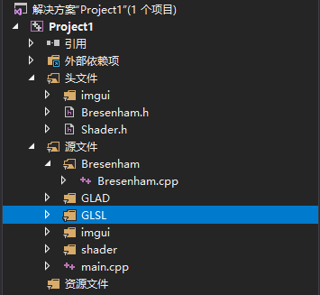

## Basic

### 一、 使用Bresenham算法(只使用integer arithmetic)画一个三角形边框：input为三个2D点；output三条直线（要求图元只能用 GL_POINTS ，不能使用其他，比如 GL_LINES 等）。

#### 1. 理论基础

使用Bresenham算法画三角形，其实只需要画3条直线即可。

Bresenham算法主要的思想就是如下图，在画直线上某一点的时候，通过比较上下两个点跟真实值之间的距离，选取距离真实值比较小的那个点即可。

假设直线的斜率为m（$\frac{y_{1}-y_{2}}{x_{1}-x_{2}}$），且||m|| <= 1。则直线可以表示为$y = mx + B$，有下面的情况。

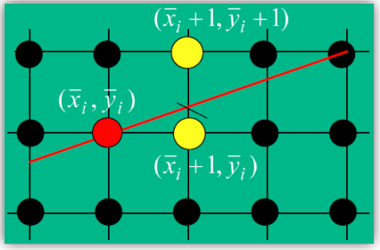

因此现在只需要判断$d_{upper}$和$d_{lower}$的大小即可。

若$d_{upper}-d_{lower}<0$，则选上面的点，反之则选下面的点。

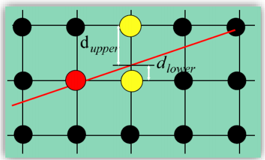

根据推导可以求得$d_{upper}$和$d_{lower}$：

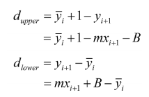

$d_{upper}-d_{lower}$可以表示为：

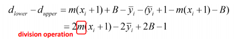

上面已经讨论过了，我们只需要知道式子的正负即可，但是式子中的斜率m并不确定。下面通过在式子两边同时乘以$\Delta x​$，化简之后有如下情况：

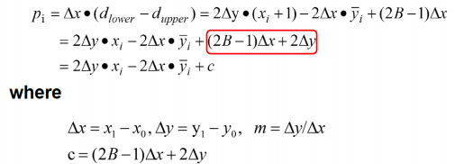

这里需要注意的是，$\Delta x$的符号是一定是正的，这样就能确保式子的符号不改变。

因此就如下的判别标准：

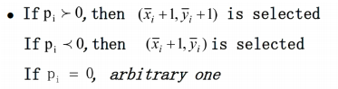

现在可以求出$p_{0}​$

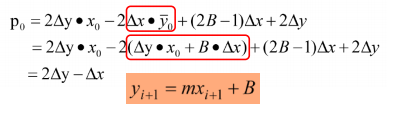

接下来是递推式

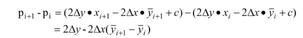

当$p_{i}<=0$时，取下面的点，y没有改变：

​	$p_{i+1} = p_{i}+2\Delta y​$

当$p_{i}>0$时，取上面的点，y需要加1：

​	$p_{i+1} = p_{i}+2\Delta y-2\Delta x​$ 	

注意：

* 这里只讨论了斜率为正的情况，斜率为负的时候，在选取点的时候是y递减。
* 这里只讨论了斜率绝对值小于1的情况，斜率绝对值大于1的时候，将x和y调换计算，以y递增，最后再将x和y调换即可。

#### 2. 实验

核心代码：

```c++
void Bresenham::triangle(int x1, int y1, int x2, int y2, int x3, int y3)
{
	generateLine(x1, y1, x2, y2);
	generateLine(x1, y1, x3, y3);
	generateLine(x2, y2, x3, y3);
}

void Bresenham::generateLine(int x1, int y1, int x2, int y2)
{
	unsigned int VAO, VBO;
	int delta_X = abs(x1 - x2);
	int delta_Y = abs(y1 - y2);

	// 斜率大于1调整x, y
	bool flag = delta_Y > delta_X;
	if (flag) {
		int temp = delta_X;
		delta_X = delta_Y;
		delta_Y = temp;
		temp = x1;
		x1 = y1;
		y1 = temp;
		temp = x2;
		x2 = y2;
		y2 = temp;
	}

	int x = x1 <= x2 ? x1 : x2;
	int y = x1 <= x2 ? y1 : y2;
	// 斜率正负
	bool positive = (x1 - x2) * (y1 - y2) >= 0;

	float vertices[1000];
	// 初始点
	int steps = delta_X + 1;
	int p = 2 * delta_Y - delta_X;
	for (int i = 0; i < steps; i++) {

		vertices[3 * i] = (flag ? (float)y : (float)(x + i)) / precision;
		vertices[3 * i + 1] = (flag ? (float)(x + i) : (float)y) / precision;
		vertices[3 * i + 2] = 0.0f;

		if (p > 0) {
			y = positive ? y + 1 : y - 1;
			p = p + 2 * delta_Y - 2 * delta_X;
		}
		else {
			p = p + 2 * delta_Y;
		}
	}

	// 渲染代码...
}
```

实验截图：

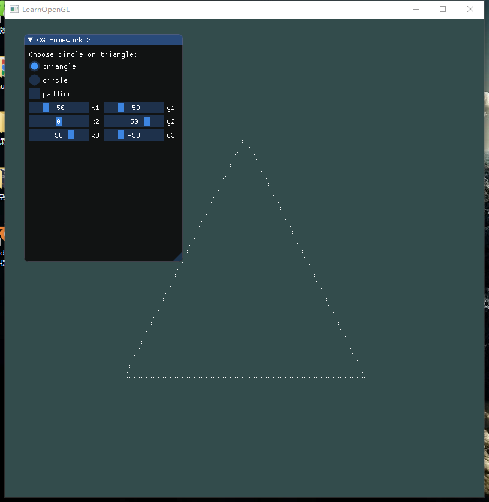

### 二、 使用Bresenham算法(只使用integer arithmetic)画一个圆：input为一个2D点(圆心)、一个integer半径；output为一个圆。

#### 1. 理论基础

上面介绍了如何使用使用Bresenham算法画直线，使用Bresenham算法画圆的思路也类似。

利用圆的对称性，我们只需要计算八分之一圆。

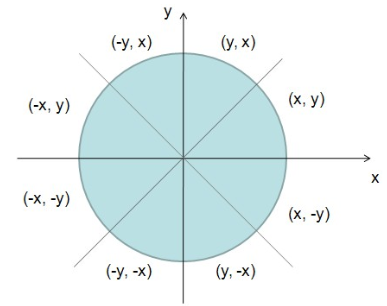

考虑如图情况：

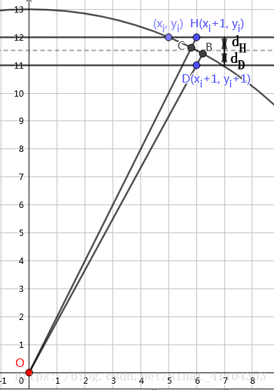

通过判断CH和BD之间的可以近似代替$d_{H}​$和$d_{D}​$，因此有以下近似：

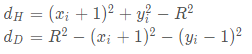

构造判别式：

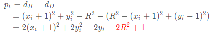

将(0,R)代入求得$p_{0}$:

​	$p_{0}=3-2R$

推导递推式：

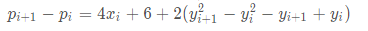

当$p_{i}<0​$时，需要选H点，y不变。

​	$p_{i+1} = p_{i}+4x_{i} + 6​$ 

当$p_{i}>=0​$时，需要选D点，y减一。

​	$p_{i+1} = p_{i}+4(x_{i}-y_{i}) + 10$ 

#### 2. 实验

核心代码：

```c++
void Bresenham::circle(int center_X, int center_Y, int radius)
{
	// 起点
	int x = 0;
	int y = radius;

	int p = 3 - 2 * radius;
	float vertices[3000];
	steps = 0;
	for (; x <= y; x++) {

		// 八分之一圆
		addPoint(x, y, vertices);
		// 对称性求其余圆
		addPoint(-x, y, vertices);
		addPoint(x, -y, vertices);
		addPoint(-x, -y, vertices);
		addPoint(y, x, vertices);
		addPoint(-y, x, vertices);
		addPoint(y, -x, vertices);
		addPoint(-y, -x, vertices);

		if (p < 0) {
			p += 4 * x  + 6;
		} else {
			p += 4 * (x- y) + 10;
			y--;
		}
	}
	// 渲染代码...
}
```

实验截图：

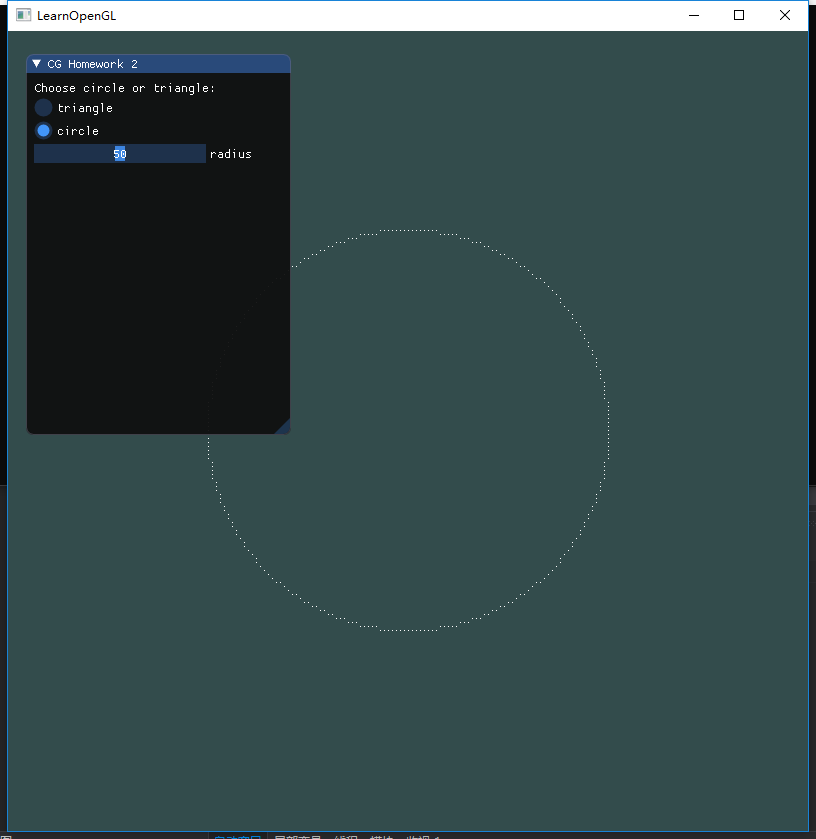

### 三、 在GUI在添加菜单栏，可以选择是三角形边框还是圆，以及能调整圆的大小(圆心固定即可)。

基本ImGui代码布局：

```c++
// Imgui框架
ImGui_ImplOpenGL3_NewFrame();
ImGui_ImplGlfw_NewFrame();
ImGui::NewFrame();

// 自定义布局
ImGui::Begin("CG Homework 2");
ImGui::Text("Choose circle or triangle: ");

ImGui::RadioButton("triangle", &show_type, 0);
ImGui::RadioButton("circle", &show_type, 1);

// 三角形布局imgui布局
if (show_type == 0) {

    ImGui::Checkbox("padding", &show_padding);

    ImGui::PushItemWidth(100);

    ImGui::SliderInt("x1", &x1, -precision, precision);
    ImGui::SameLine();
    ImGui::SliderInt("y1", &y1, -precision, precision);

    ImGui::SliderInt("x2", &x2, -precision, precision);
    ImGui::SameLine();
    ImGui::SliderInt("y2", &y2, -precision, precision);

    ImGui::SliderInt("x3", &x3, -precision, precision);
    ImGui::SameLine();
    ImGui::SliderInt("y3", &y3, -precision, precision);
}

// 圆布局imgui布局
if (show_type == 1) {
    ImGui::SliderInt("radius", &radius, 0, 100);
}
ImGui::NextColumn();
ImGui::End();
```

实验截图：

调整三角形顶点

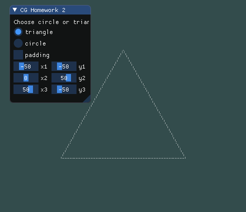

调整圆半径

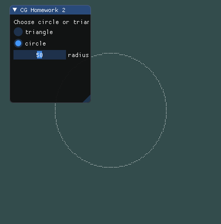

### Bonus: 使用三角形光栅转换算法，用和背景不同的颜色，填充你的三角形。

#### 理论基础

填充三角形的关键就是如何确定需要填充的点。

基本的思路就是，找到一个包含三角形的矩形，遍历矩形，确定每个点是否在三角形内即可，确定一个点是否在三角形内使用**同向法**。

首先使用直线的两点式计算出三角形三条边的直线方程。

假设直线上两点为(x1, y1), (x2, y2)，则有$\frac{x-x1}{x2-x1} = \frac{y-y1}{y2-y1}$，化简得到直线方程

​	$a*x+b*y-b*y1-a*x1=0$，其中$a=y_{2}-y_{1}, b=-(x_{2}-x_{1})$

这样就可以获得三角形三条边的直线方程。

**同向法**

假设三角形另外一个点为(x3, y3)，以及当前遍历到的点(p1, p2)。

1. 将这两个点分别代入由(x1,y1)和(x2,y2)计算出的直线方程得到两个结果out1和out2。
2. out1和out2的正负表示了他们位于直线位置，如果同号，则说明在同一侧，否则说明不在同一侧。

利用同向法，我们可以通过根据(p1,p2)是否与三条直线对应的顶点同侧来判断该点是否在三角形中。可以看下图。

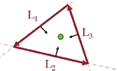

#### 实验

核心代码：

```c++
void Bresenham::padding(int x1, int y1, int x2, int y2, int x3, int y3)
{
	int max_x = getMax(x1, x2, x3);
	int max_y = getMax(y1, y2, y3);
	int min_x = getMin(x1, x2, x3);
	int min_y = getMin(y1, y2, y3);


	float vertices[100000];
	int pointNum = 0;
	// 直线方程
	int a1 = y2 - y1, b1 = -(x2 - x1), c1 = -b1 * y1 - a1 * x1;
	int a2 = y3 - y2, b2 = -(x3 - x2), c2 = -b2 * y2 - a2 * x2;
	int a3 = y3 - y1, b3 = -(x3 - x1), c3 = -b3 * y1 - a3 * x1;

	for (int i = min_x; i <= max_x; i++) {
		for (int j = min_y; j <= max_y; j++) {
			if (checkSameSide(a1, b1, c1, i, j, x3, y3) &&
				checkSameSide(a2, b2, c2, i, j, x1, y1) &&
				checkSameSide(a3, b3, c3, i, j, x2, y2)) {

				vertices[3 * pointNum] = (float)i / precision;
				vertices[3 * pointNum + 1] = (float)j / precision;
				vertices[3 * pointNum + 2] = 0.0f;
				pointNum++;
			}
		}
	}

	// 渲染代码...

}

int Bresenham::getMax(int n1, int n2, int n3)
{
	int max = n1 > n2 ? n1 : n2;
	max = max > n3 ? max : n3;
	return max;
}

int Bresenham::getMin(int n1, int n2, int n3)
{
	int min = n1 < n2 ? n1 : n2;
	min = min < n3 ? min : n3;
	return min;
}

bool Bresenham::checkSameSide(int a, int b, int c, int x, int y, int p1, int p2)
{
	return a*x + b*y + c >= 0 && a * p1 + b * p2 + c >= 0 ||
		a * x + b * y + c <= 0 && a * p1 + b * p2 + c <= 0;
}
```

实验截图：

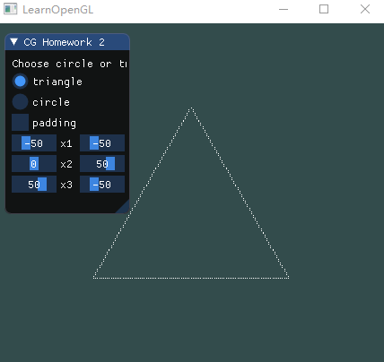

PS：本文使用了LateX语法，如果没有mathjax插件应该看不到数学公式，建议去看[pdf](./report.pdf)。

