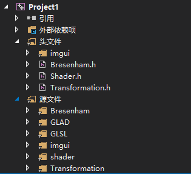
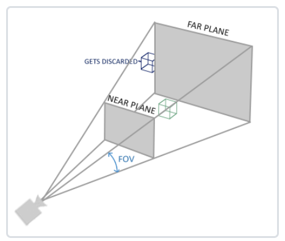
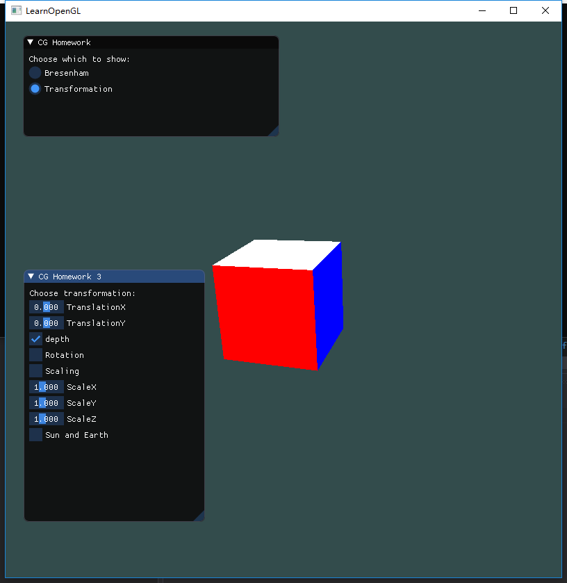
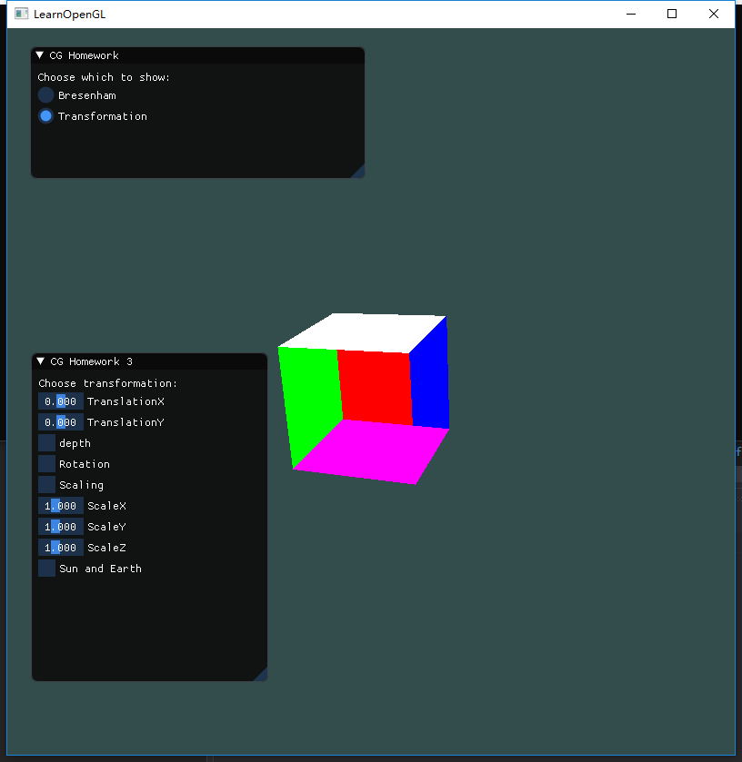
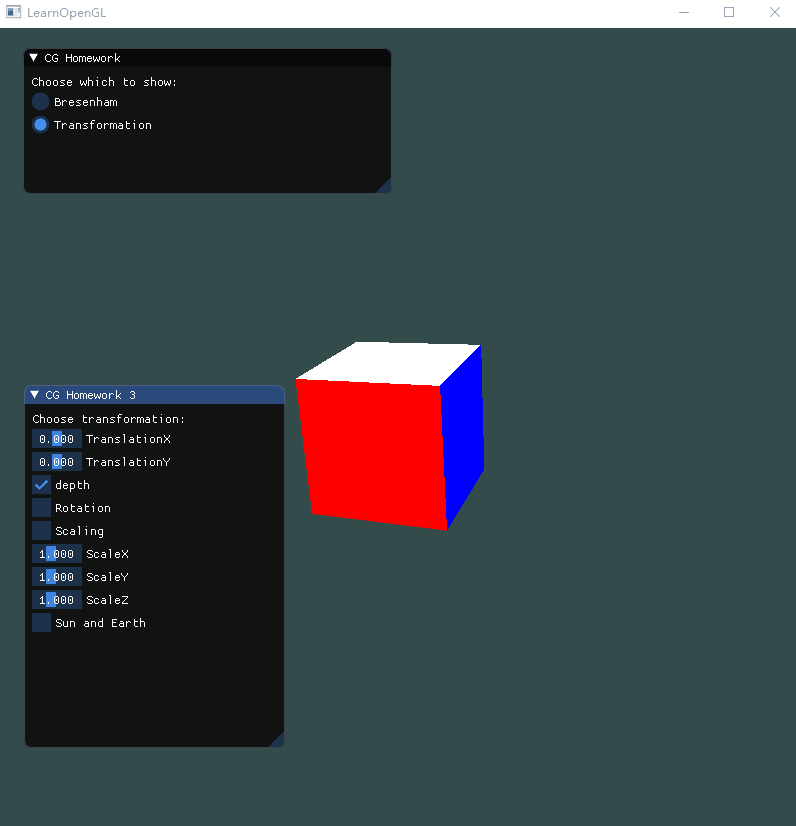
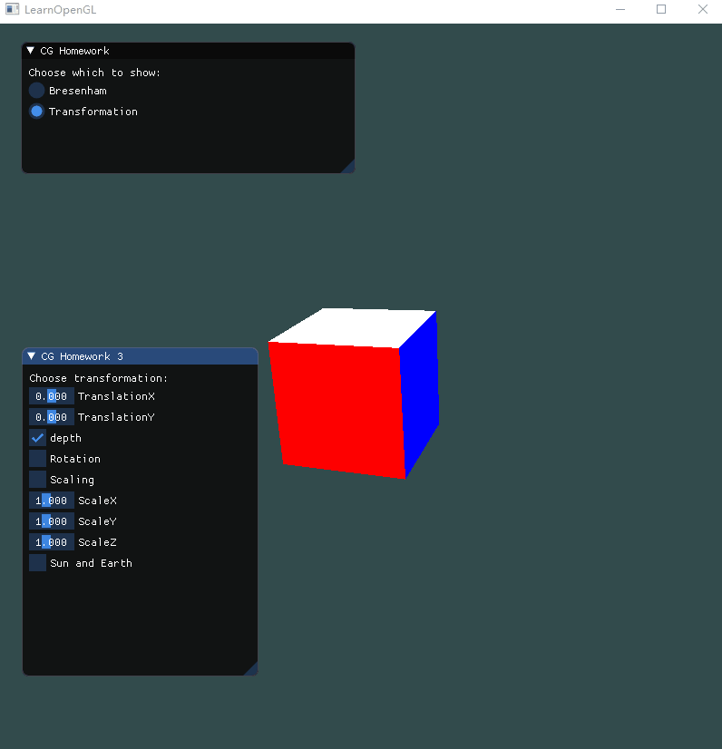
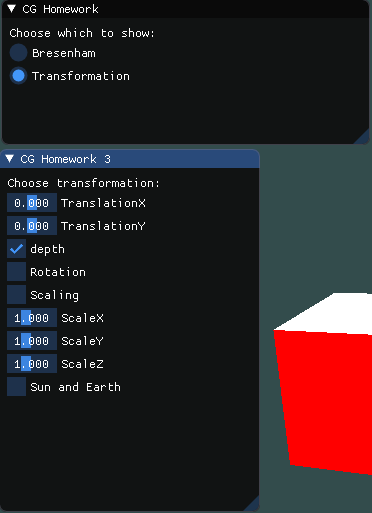
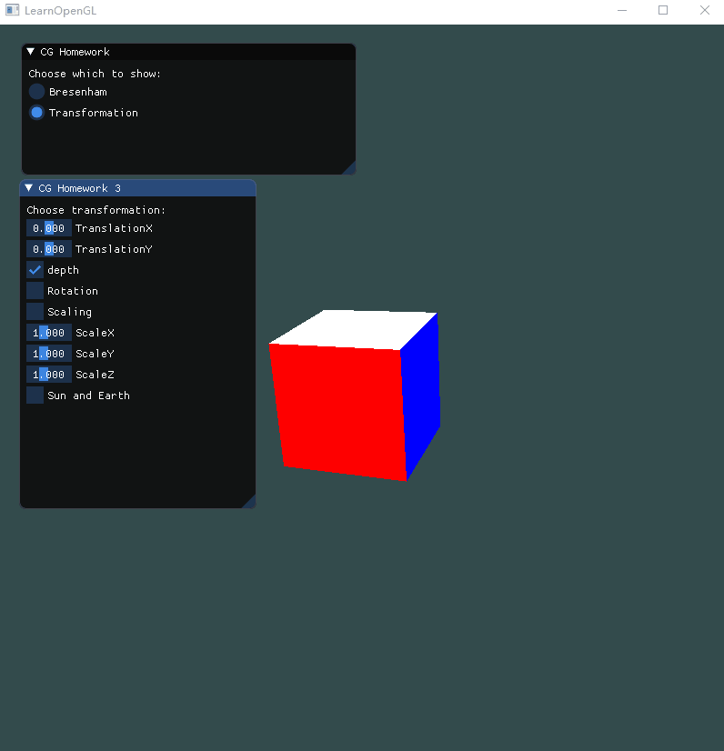

## 计算机图形学 | hw4

如果想看动图可以前往[github](https://github.com/CookiesChen/CG/blob/master/week6/doc/report.md)

### 准备工作

#### 文件结构



Tramformation类专门用于本次实验，主要处理了渲染，imgui和各种变换。

#### GLM

CG的变换涉及到大量的数学运算，比如向量运算、矩阵运算。GLM(OpenGL Mathematics)就是这样一个，专门为OpenGL而设的，抽象了所有复杂繁琐的数学运算细节，极其易于使用的数学库。

GLM是一个只有头文件的库，也就是只需把所有.h文件放到我们的/include文件夹就可以使用。

#### 顶点GLSL源代码

在这里因为使用了坐标变换，因此需要引入全局uniform对局部坐标进行变换。

主要的变换就是局部坐标的变换，摄像机的变换以及投影。

```
#version 330 core
layout(location = 0) in vec3 aPos;
layout(location = 1) in vec3 color;

out vec3 ourColor;

uniform mat4 model;
uniform mat4 view;
uniform mat4 projection;

void main()
{
	gl_Position = projection * view * model * vec4(aPos, 1.0);
	ourColor = color;
}
```

上面修改了源代码，添加了uniform，因此shader也需要增加设置uniform的方法。

```c++
void Shader::setMat4(const std::string& name, glm::mat4 value) const
{
	glUniformMatrix4fv(glGetUniformLocation(ID, name.c_str()) , 1, GL_FALSE, glm::value_ptr(value));
}
```

#### 变换矩阵

* model：将局部坐标系转换为世界坐标系。

* view：将世界坐标系转换为摄像机坐标系。

* projection：将摄像机坐标系进行裁剪，将摄像机坐标系转换为屏幕坐标系。

  ```
  projection = glm::perspective(glm::radians(60.0f), (float)width / (float)height, 0.1f, 100.0f);
  ```

  GLM中提供的透视投影如上，第一个参数代表fov，第二个参数是aspect，第三个参数是near，第四个参数是far。这里解释一下第一个参数的作用，fov表示视野，当fov增大的时候，看见范围就会增大，这样投影到屏幕的区域就会变大。

  

### Basic:

#### 1. 画一个立方体(cube)：边长为4， 中心位置为(0, 0, 0)。分别启动和关闭深度测试glEnable(GL_DEPTH_TEST) 、 glDisable(GL_DEPTH_TEST) ，查看区别，并分析原因。

绘制立方体，主要使用6个面，每个面2个三角形，一共36个顶点即可，为每个顶点配置颜色，一共216个元素。顶点数据如下：

```
float vertices[216] = {
		-0.5f, -0.5f, -0.5f,  0.0f, 0.0f, 0.0f,
		 0.5f, -0.5f, -0.5f,  0.0f, 0.0f, 0.0f,
		 0.5f,  0.5f, -0.5f,  0.0f, 0.0f, 0.0f,
		 0.5f,  0.5f, -0.5f,  0.0f, 0.0f, 0.0f,
		-0.5f,  0.5f, -0.5f,  0.0f, 0.0f, 0.0f,
		-0.5f, -0.5f, -0.5f,  0.0f, 0.0f, 0.0f,

		-0.5f, -0.5f,  0.5f,  1.0f, 0.0f, 0.0f,
		 0.5f, -0.5f,  0.5f,  1.0f, 0.0f, 0.0f,
		 0.5f,  0.5f,  0.5f,  1.0f, 0.0f, 0.0f,
		 0.5f,  0.5f,  0.5f,  1.0f, 0.0f, 0.0f,
		-0.5f,  0.5f,  0.5f,  1.0f, 0.0f, 0.0f,
		-0.5f, -0.5f,  0.5f,  1.0f, 0.0f, 0.0f,

		-0.5f,  0.5f,  0.5f,  0.0f, 1.0f, 0.0f,
		-0.5f,  0.5f, -0.5f,  0.0f, 1.0f, 0.0f,
		-0.5f, -0.5f, -0.5f,  0.0f, 1.0f, 0.0f,
		-0.5f, -0.5f, -0.5f,  0.0f, 1.0f, 0.0f,
		-0.5f, -0.5f,  0.5f,  0.0f, 1.0f, 0.0f,
		-0.5f,  0.5f,  0.5f,  0.0f, 1.0f, 0.0f,

		 0.5f,  0.5f,  0.5f,  0.0f, 0.0f, 1.0f,
		 0.5f,  0.5f, -0.5f,  0.0f, 0.0f, 1.0f,
		 0.5f, -0.5f, -0.5f,  0.0f, 0.0f, 1.0f,
		 0.5f, -0.5f, -0.5f,  0.0f, 0.0f, 1.0f,
		 0.5f, -0.5f,  0.5f,  0.0f, 0.0f, 1.0f,
		 0.5f,  0.5f,  0.5f,  0.0f, 0.0f, 1.0f,

		-0.5f, -0.5f, -0.5f,  1.0f, 0.0f, 1.0f,
		 0.5f, -0.5f, -0.5f,  1.0f, 0.0f, 1.0f,
		 0.5f, -0.5f,  0.5f,  1.0f, 0.0f, 1.0f,
		 0.5f, -0.5f,  0.5f,  1.0f, 0.0f, 1.0f,
		-0.5f, -0.5f,  0.5f,  1.0f, 0.0f, 1.0f,
		-0.5f, -0.5f, -0.5f,  1.0f, 0.0f, 1.0f,

		-0.5f,  0.5f, -0.5f,  1.0f, 1.0f, 1.0f,
		 0.5f,  0.5f, -0.5f,  1.0f, 1.0f, 1.0f,
		 0.5f,  0.5f,  0.5f,  1.0f, 1.0f, 1.0f,
		 0.5f,  0.5f,  0.5f,  1.0f, 1.0f, 1.0f,
		-0.5f,  0.5f,  0.5f,  1.0f, 1.0f, 1.0f,
		-0.5f,  0.5f, -0.5f,  1.0f, 1.0f, 1.0f

	};
```

下面两张图分别是glEnable(GL_DEPTH_TEST) 和 glDisable(GL_DEPTH_TEST)。





使用glEnable(GL_DEPTH_TEST)深度测试的时候，需要在渲染循环中清除深度值数据。

```
glClear(GL_COLOR_BUFFER_BIT | GL_DEPTH_BUFFER_BIT);
```

**原因分析：**出现上面这种情况是深度测试的问题，glEnable使用了Z缓冲，这样GLFW就会为你生成一个缓冲，深度值存储在每个片段中，当片段要输出颜色的时候，会将深度值与z缓冲进行比较，如果该片段在其他片段之后，就会被丢弃，反之则覆盖。

#### 2. 平移(Translation)：使画好的cube沿着水平或垂直方向来回移动。

平移只需要在局部坐标中进行即可，主要就是使用glm::translate函数，使用imgui控制平移。

```c++
model = glm::translate(model, glm::vec3(translatio_x, translatio_y, 0.0f));
```



#### 3. 旋转(Rotation)：使画好的cube沿着XoZ平面的x=z轴持续旋转。

平移只需要在局部坐标中进行即可，主要就是使用glm::rotate函数。

```c++
model = glm::rotate(model, (float)glfwGetTime(), glm::vec3(1.0f, 0.0f, 1.0f));
```



#### 4. 放缩(Scaling)：使画好的cube持续放大缩小。

平移只需要在局部坐标中进行即可，主要就是使用glm::scale函数，既可以持续放大缩小，也使用imgui控制x,y,z的放缩。

持续放缩需要使用sin函数，通过当前时间生成0到1的数字就可以完成持续的放大和缩小。

```
model = glm::scale(model, (abs(sin((float)glfwGetTime())) + 0.1f) * glm::vec3(scale_x, scale_y, scale_z));
```


#### 5. 在GUI里添加菜单栏，可以选择各种变换。

```c++
void Transformation::widget() {

	ImGui::Begin("CG Homework 3");
	ImGui::Text("Choose transformation: ");

	ImGui::PushItemWidth(50);
	ImGui::SliderFloat("TranslationX", &translatio_x, -1.0f, 1.0f);
	ImGui::SliderFloat("TranslationY", &translatio_y, -1.0f, 1.0f);
	ImGui::Checkbox("depth", &depth);
	ImGui::Checkbox("Rotation", &rotation);
	ImGui::Checkbox("Scaling", &scaling);
	ImGui::SliderFloat("ScaleX", &scale_x, 0.5f, 2.0f);
	ImGui::SliderFloat("ScaleY", &scale_y, 0.5f, 2.0f);
	ImGui::SliderFloat("ScaleZ", &scale_z, 0.5f, 2.0f);
	ImGui::Checkbox("Sun and Earth", &bonus);

	ImGui::NextColumn();
	ImGui::End();
}
```



#### 6. 结合Shader谈谈对渲染管线的理解

渲染管线分为4个阶段：

* 顶点数据输入与变换：在使用shader的时候，需要给VBO顶点数据，VBO解析出各个顶点的属性，位置的变换、光照和纹理坐标变换。
* 图元装配：在输入顶点之后，需要有变换后顶点的连通性信息，例如画直线或者三角形，通过图元提供的连通性信息，将图元转化为片段。
* 光栅化：片段形状插值出图形区域的像素。
* 着色。

顶点着色器主要作用于第一个阶段，片段着色器作用于第四个阶段。

### Bonus：将以上三种变换相结合，打开你们的脑洞，实现有创意的动画。比如：地球绕太阳转等。

主要的操作有3个：

* 摄像机的调整：先将摄像机沿着Z轴正方向平移，再绕着x和y轴旋转30度。

  ```c++
  view = glm::translate(view, glm::vec3(0.0f, 0.0f, -5.0f));
  view = glm::rotate(view, glm::radians(30.0f), glm::vec3(1.0f, -1.0f, 0.0f));
  ```

* 地球旋转：使用平移实现，在局部坐标中，根据当前时间通过sin和cos函数生成x和y的位移（位置），就可以轻松实现。

  ```c++
  float radius = 2.0f;
  float camX = sin(glfwGetTime()) * radius;
  float camZ = cos(glfwGetTime()) * radius;
  
  model = glm::translate(model, glm::vec3(camX, 0.0f, camZ));
  model = glm::rotate(model, (float)glfwGetTime(), glm::vec3(0.0f, 1.0f, 0.0f));
  model = glm::scale(model, 0.5f * glm::vec3(1.0f, 1.0f, 1.0f));
  ```

* 多个立方体：在局部坐标变换完成后，直接调用glDrawArrays进行绘制

  ```c++
  float radius = 2.0f;
  float camX = sin(glfwGetTime()) * radius;
  float camZ = cos(glfwGetTime()) * radius;
  
  model = glm::translate(model, glm::vec3(camX, 0.0f, camZ));
  model = glm::rotate(model, (float)glfwGetTime(), glm::vec3(0.0f, 1.0f, 0.0f));
  model = glm::scale(model, 0.5f * glm::vec3(1.0f, 1.0f, 1.0f));
  
  shader.setMat4("model", model);
  glDrawArrays(GL_TRIANGLES, 0, 36);
  
  model = glm::mat4(1.0f);
  model = glm::rotate(model, (float)glfwGetTime()*0.5f, glm::vec3(0.0f, 1.0f, 0.0f));
  
  shader.setMat4("model", model);
  glDrawArrays(GL_TRIANGLES, 0, 36);
  ```

