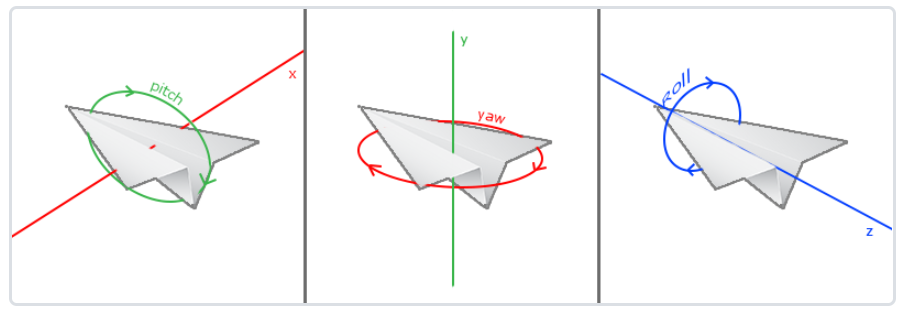

## 计算机图形学 | hw5

如果想看动图可以前往[github](https://github.com/CookiesChen/CG/blob/master/week7/doc/report.md)

### Basic

#### 1. 投影(Projection)

要求：

* 把上次作业绘制的cube放置在(-1.5, 0.5, -1.5)位置，要求6个面颜色不一致
* 正交投影(orthographic projection)：实现正交投影，使用多组(left, right, bottom, top, near, far)参数，比较结果差异
* 透视投影(perspective projection)：实现透视投影，使用多组参数，比较结果差异

实现：

* 绘制部分就略过了，上次的报告中提供了顶点，6个面的颜色都是一致的，将cude放置在(-1.5, 0.5, -1.5)位置，需要使用glm提供的translate函数。

  ```c++
  model = glm::translate(model, glm::vec3(-1.5f, 0.5f, -1.5f));
  ```

* 正交投影需要使用glm提供的`ortho`方法，参数分别是left, right, bottom, top, near, far，分别代表截取空间的边界。

  

  ```c++
  projection = glm::ortho(left, right, bottom, top, nea, fa);
  ```

  

  由动图可以看到，当调节左边界的时候，所截取的空间范围缩小时，cude会被拉大，因为空间缩小，cude的占比变大，因此出现上面的情况。当调节near面的时候，会发现在1.0处，红色变为黑色，因为红色是正对着我们的面，黑色被背面，在near变大的时候，截取不到红色的面，因此就显示成黑色了。同理，当far变小的时候，最终截取不到cude，因此cude就消失了。

* 正交投影需要使用glm提供的`perspective`方法，参数分别是fovy, aspect, zNear, zFar。

  

  ```c++
  projection = glm::perspective(glm::radians(fov), aspect, zNear, zFar);
  ```

  

  由动图可以看到，fov代表镜头的视野角度，当fov增大，视野越大，但是cude大小不变，导致cude占比变小，因此视觉上cude变小，aspect表示水平拉伸的程度，最后两个参数与正交投影的类似。

#### 2. 视角变换(View Changing)

要求：把cube放置在(0, 0, 0)处，做透视投影，使摄像机围绕cube旋转，并且时刻看着cube中心

理论基础：视角变换涉及到摄影空间，需要确定摄像机的位置以及摄影空间的基向量。**摄像机位置**简单来说就是世界空间中的一个指向摄像机的向量。**摄像机方向**可以简单用**摄像机位置**和**目标物体位置**两个矢量的差来表示。**右轴**也叫**右向量**，在确定右轴之前，需要自己定义一个**上向量**，这个向量不需要跟**摄像机方向**垂直，然后通过**摄像机方向**与**上向量**进行叉乘，就能得到右轴。上轴就是用**摄像机方向**和**右轴**进行叉乘。

实验实现：glm提供了一个`lookAt`函数，需要的参数分别是**摄像机位置**，**目标位置**和**上向量**，因此能够直接使用lookAt矩阵。


摄像机的位置在xz平面上绕着y轴旋转，并且一直look at立方体，就能实现摄像机绕着物体旋转。因此需要使用圆的定义。

```c++
float radius = 3.0f;
float cam1 = sin(glfwGetTime()) * radius;
float cam2 = cos(glfwGetTime()) * radius;

view = glm::lookAt(glm::vec3(cam1, 0.0, cam2), glm::vec3(0.0, 0.0, 0.0), glm::vec3(0.0, 1.0, 0.0));
projection = glm::perspective(glm::radians(60.0f), (float)width / (float)height, 0.1f, 100.0f);
```


#### 3. 在GUI里添加菜单栏，可以选择各种功能

所有的imgui都集中在view 的widget中。

```c++
void View::widget() {

	ImGui::Begin("CG Homework 4");
	ImGui::Text("Choose View Change: ");
	ImGui::NextColumn();

	ImGui::RadioButton("Projection", &view_type, 0);
	ImGui::RadioButton("View Changing", &view_type, 1);
	ImGui::RadioButton("FPS", &view_type, 2);

	if (view_type == 0) {
		ImGui::RadioButton("perspective", &projection_type, 0);
		ImGui::RadioButton("orthographic", &projection_type, 1);
		if (projection_type == 0) {
			ImGui::SliderFloat("fov", &fov, 30.0f, 90.0f);
			ImGui::SliderFloat("aspect", &aspect, 0.0f, 2.0f);
			ImGui::SliderFloat("zNear", &zNear, 0.0f, 50.0f);
			ImGui::SliderFloat("zFar", &zFar, 50.0f, 100.0f);
		}
		else if (projection_type == 1) {
			ImGui::SliderFloat("left", &left, -3.0f, -1.5f);
			ImGui::SliderFloat("right", &right, -1.5f, 0.0f);
			ImGui::SliderFloat("bottom", &bottom, -1.0f, 0.5f);
			ImGui::SliderFloat("top", &top, 0.5f, 2.0f);
			ImGui::SliderFloat("nea", &nea, 0.5f, 2.5f);
			ImGui::SliderFloat("fa", &fa, 0.5f, 2.5f);
		}
	}
	ImGui::End();
}
```

#### 4. 简答

在现实生活中，我们一般将摄像机摆放的空间View matrix和被拍摄的物体摆设的空间Model matrix分开，但是在OpenGL中却将两个合二为一设为ModelView matrix，通过上面的作业启发，你认为是为什么呢？在报告中写入。（Hints：你可能有不止一个摄像机）

两个矩阵结合之后，可以使得摄像机和物体处于同一空间，不需要进行坐标变换，在多摄像机的场景下，就需要在物体和多个摄影机空间之间进行转换。

#### 参数初始化

摄像机位置，上轴，方向和右轴的计算

```c++
Camera::Camera()
{
	position = glm::vec3(0.0f, 0.0f, 3.0f);
	up = glm::vec3(0.0f, 1.0f, 0.0f);
	world_up = glm::vec3(0.0f, 1.0f, 0.0f);
	front = glm::vec3(0.0f, 0.0f, -1.0f);

	updateVector();
}
```

`updateVector`方法就是用于计算上轴和右轴的。

```c++
void Camera::updateVector()
{
	glm::vec3 new_front;
	new_front.x = cos(glm::radians(yaw)) * cos(glm::radians(pitch));
	new_front.y = sin(glm::radians(pitch));
	new_front.z = sin(glm::radians(yaw)) * cos(glm::radians(pitch));
	front = glm::normalize(new_front);
	
	right = glm::normalize(glm::cross(front, world_up));
	up = glm::normalize(glm::cross(right, front));
}
```

#### 事件监听

键盘事件监听，需要使用`glfwGetKey`捕获键盘动作。

```c++
// 处理输入
void processInput(GLFWwindow* window)
{
	if (glfwGetKey(window, GLFW_KEY_ESCAPE) == GLFW_PRESS)
		glfwSetWindowShouldClose(window, true);

	if (glfwGetKey(window, GLFW_KEY_W) == GLFW_PRESS)
		view.processMove(0, deltaTime);
	if (glfwGetKey(window, GLFW_KEY_S) == GLFW_PRESS)
		view.processMove(1, deltaTime);
	if (glfwGetKey(window, GLFW_KEY_A) == GLFW_PRESS)
		view.processMove(2, deltaTime);
	if (glfwGetKey(window, GLFW_KEY_D) == GLFW_PRESS)
		view.processMove(3, deltaTime);
}

processInput(window);
```

鼠标移动事件监听

```
void mouse_callback(GLFWwindow* window, double xpos, double ypos);
glfwSetCursorPosCallback(window, mouse_callback);
```

鼠标滚动事件监听

```g++
void mouse_callback(GLFWwindow* window, double xpos, double ypos);
glfwSetScrollCallback(window, scroll_callback);
```

#### 前后左右移动

计算位移，利用`glfwGetTime`获取当前时间，与上一时刻的时间相减就能很方便的得到位移。

```c++
float currentTime = glfwGetTime();
deltaTime = currentTime - lastTime;
lastTime = currentTime;
```

camera类处理前后左右移动

```c++
void Camera::moveForward(float const distance)
{
	position += front * distance;
}

void Camera::moveBack(float const distance)
{
	position -= front * distance;
}

void Camera::moveRight(float const distance)
{
	position += glm::normalize(glm::cross(front, up)) * distance;
}

void Camera::moveLeft(float const distance) 
{
	position -= glm::normalize(glm::cross(front, up)) * distance;
}
```

这里在处理左右移动的时候用到了叉乘，计算出与yz平面垂直的向量，就能实现横移。

#### 视角移动

在这里需要了解欧拉角，一共有3种欧拉角：俯仰角(Pitch)、偏航角(Yaw)和滚转角(Roll)。



在这里不需要使用到roll角，主要处理pitch和yaw即可。


当pitch变化的时候，通过余弦和正弦函数可以从图中得到以下关系（斜边为1）：

```c++
direction.x = cos(glm::radians(pitch));
direction.y = sin(glm::radians(pitch));
direction.z = cos(glm::radians(pitch));
```

当yaw变化时，最终得出以下关系。


```c++
direction.x = cos(glm::radians(pitch)) * cos(glm::radians(yaw)); 
direction.y = sin(glm::radians(pitch));
direction.z = cos(glm::radians(pitch)) * sin(glm::radians(yaw));
```

camare实现如下，为了防止仰角大于90度导致视角反转，需要进行控制，并且加入了鼠标灵敏度。

```c++
void Camera::rotate(float const xOffset, float const yOffset)
{
	yaw += xOffset * sensitivity;
	pitch += yOffset * sensitivity;

	if (pitch > 89.0f)
		pitch = 89.0f;
	if (pitch < -89.0f)
		pitch = -89.0f;

	updateVector();
}
```

### 缩放

缩放需要利用的属性是透视投影中的fov，上面也说到，fov控制的是视野的角度。实现中加入了范围限制。

```c++
void View::processScroll(double xOffset, double yOffset)
{
	if (view_type == 2) {
		if (scroll_fov >= 60.0f && scroll_fov <= 80.0f)
			scroll_fov -= yOffset;
		if (scroll_fov <= 60.0f)
			scroll_fov = 60.0f;
		if (scroll_fov >= 80.0f)
			scroll_fov = 80.0f;
	}
}
projection = glm::perspective(glm::radians(scroll_fov), (float)width / (float)height, 0.1f, 100.0f);
```


