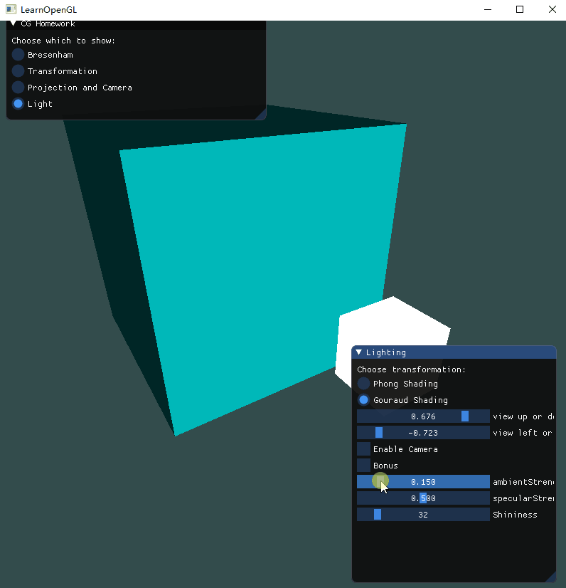
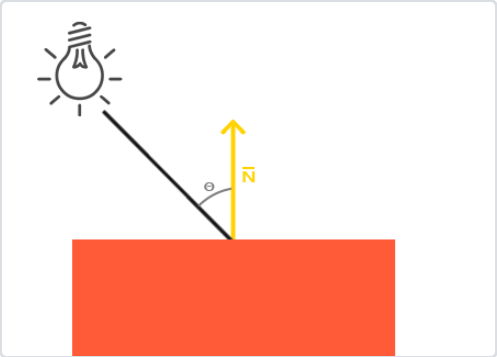
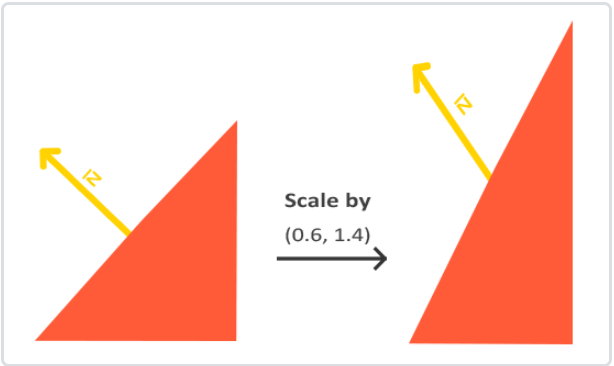
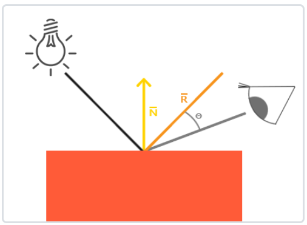
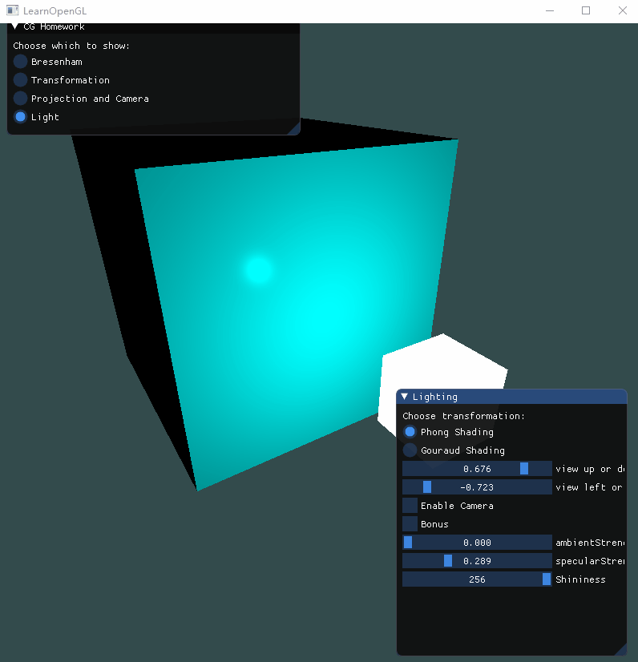
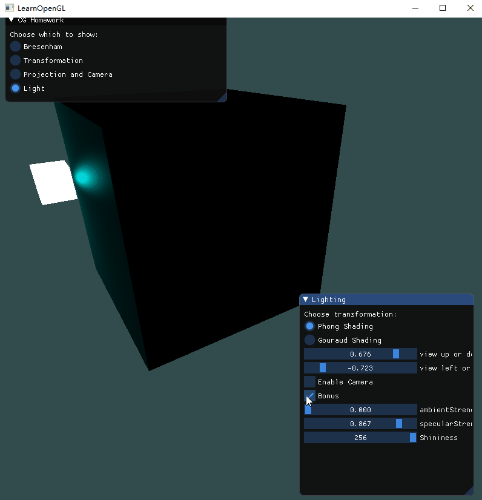
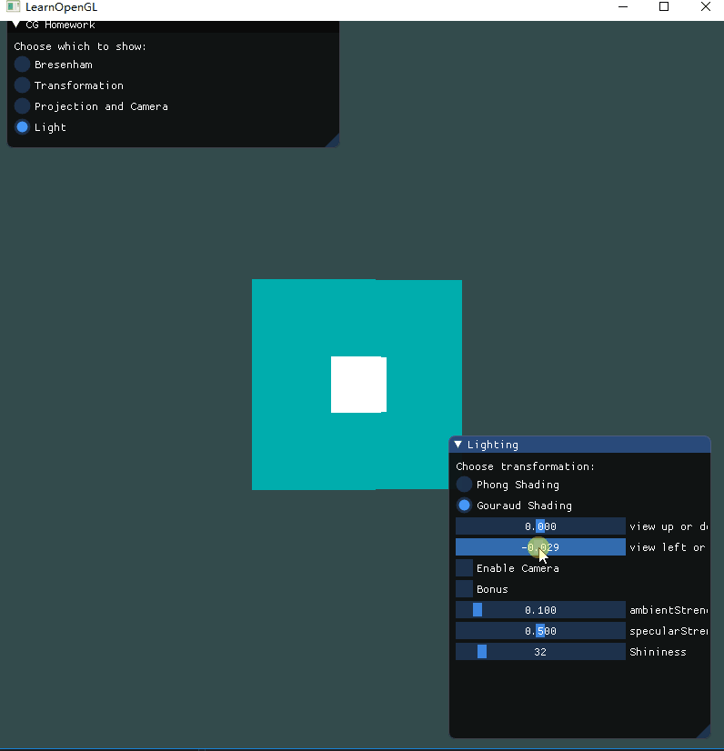
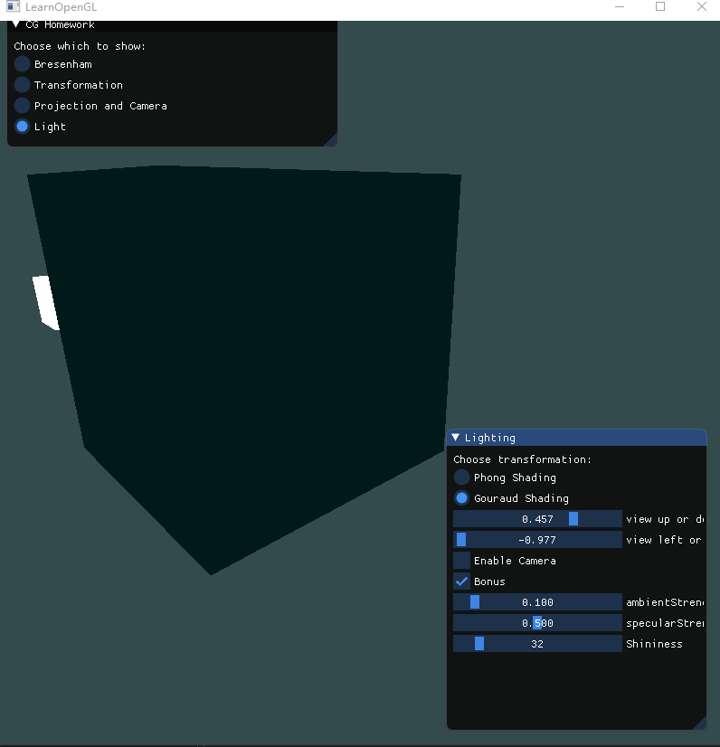

## 计算机图形学 | hw6

如果想看动图可以前往[github](https://github.com/CookiesChen/CG/blob/master/week9/doc/report.md)

###Phong光照模型

本次实验需要实现Phong光照模型，模型的主要结构由三个部分构成：**环境(Ambient)**、**漫反射(Diffuse)**和**镜面(Specular)**光照。在介绍三个基本构成部分之前，先设置好光源和物体。

#### 顶点数据

```c++
float vertices[216] = {
    -0.5f, -0.5f, -0.5f,  0.0f,  0.0f, -1.0f,
    0.5f, -0.5f, -0.5f,  0.0f,  0.0f, -1.0f,
    0.5f,  0.5f, -0.5f,  0.0f,  0.0f, -1.0f,
    0.5f,  0.5f, -0.5f,  0.0f,  0.0f, -1.0f,
    -0.5f,  0.5f, -0.5f,  0.0f,  0.0f, -1.0f,
    -0.5f, -0.5f, -0.5f,  0.0f,  0.0f, -1.0f,

    -0.5f, -0.5f,  0.5f,  0.0f,  0.0f, 1.0f,
    0.5f, -0.5f,  0.5f,  0.0f,  0.0f, 1.0f,
    0.5f,  0.5f,  0.5f,  0.0f,  0.0f, 1.0f,
    0.5f,  0.5f,  0.5f,  0.0f,  0.0f, 1.0f,
    -0.5f,  0.5f,  0.5f,  0.0f,  0.0f, 1.0f,
    -0.5f, -0.5f,  0.5f,  0.0f,  0.0f, 1.0f,

    -0.5f,  0.5f,  0.5f, -1.0f,  0.0f,  0.0f,
    -0.5f,  0.5f, -0.5f, -1.0f,  0.0f,  0.0f,
    -0.5f, -0.5f, -0.5f, -1.0f,  0.0f,  0.0f,
    -0.5f, -0.5f, -0.5f, -1.0f,  0.0f,  0.0f,
    -0.5f, -0.5f,  0.5f, -1.0f,  0.0f,  0.0f,
    -0.5f,  0.5f,  0.5f, -1.0f,  0.0f,  0.0f,

    0.5f,  0.5f,  0.5f,  1.0f,  0.0f,  0.0f,
    0.5f,  0.5f, -0.5f,  1.0f,  0.0f,  0.0f,
    0.5f, -0.5f, -0.5f,  1.0f,  0.0f,  0.0f,
    0.5f, -0.5f, -0.5f,  1.0f,  0.0f,  0.0f,
    0.5f, -0.5f,  0.5f,  1.0f,  0.0f,  0.0f,
    0.5f,  0.5f,  0.5f,  1.0f,  0.0f,  0.0f,

    -0.5f, -0.5f, -0.5f,  0.0f, -1.0f,  0.0f,
    0.5f, -0.5f, -0.5f,  0.0f, -1.0f,  0.0f,
    0.5f, -0.5f,  0.5f,  0.0f, -1.0f,  0.0f,
    0.5f, -0.5f,  0.5f,  0.0f, -1.0f,  0.0f,
    -0.5f, -0.5f,  0.5f,  0.0f, -1.0f,  0.0f,
    -0.5f, -0.5f, -0.5f,  0.0f, -1.0f,  0.0f,

    -0.5f,  0.5f, -0.5f,  0.0f,  1.0f,  0.0f,
    0.5f,  0.5f, -0.5f,  0.0f,  1.0f,  0.0f,
    0.5f,  0.5f,  0.5f,  0.0f,  1.0f,  0.0f,
    0.5f,  0.5f,  0.5f,  0.0f,  1.0f,  0.0f,
    -0.5f,  0.5f,  0.5f,  0.0f,  1.0f,  0.0f,
    -0.5f,  0.5f, -0.5f,  0.0f,  1.0f,  0.0f

};
```

前面三个为位置，后面三个为法向量。

#### 光源与物体

光源和物体都使用立方体，需要使用两个着色器。

光源着色器`glsl`代码比较简单，只需要把颜色固定为白色，并且使用通用的坐标变换。

```glsl
// 顶点着色器
#version 330 core
layout(location = 0) in vec3 aPos;

uniform mat4 model;
uniform mat4 view;
uniform mat4 projection;

void main()
{
	gl_Position = projection * view * model * vec4(aPos, 1.0);
}

// 片段着色器
#version 330 core
out vec4 FragColor;

void main()
{
	FragColor = vec4(1.0);
}
```

物体着色器在介绍三个构成部分的时候会介绍，在这里可以先简单的使用光源代码，后续再做修改。

使用着色器绘制光源和物体，需要重新定义一个VAO然后复用已经保存了顶点数值的VBO，注意光源不需要使用位置1的法向量数据，该数据在漫反射和镜面反射光照中需要使用。

```c++
// 物体
unsigned int VBO;
glGenBuffers(1, &VBO);
glBindBuffer(GL_ARRAY_BUFFER, VBO);
glBufferData(GL_ARRAY_BUFFER, sizeof(vertices), vertices, GL_STATIC_DRAW);

unsigned int cubeVAO;
glBindBuffer(GL_ARRAY_BUFFER, VBO);

glGenVertexArrays(1, &cubeVAO);
glBindVertexArray(cubeVAO);
// 位置
glVertexAttribPointer(0, 3, GL_FLOAT, GL_FALSE, 6 * sizeof(float), (void*)0);
glEnableVertexAttribArray(0);
// 法向量
glVertexAttribPointer(1, 3, GL_FLOAT, GL_FALSE, 6 * sizeof(float), (void*)(3 * sizeof(float)));
glEnableVertexAttribArray(1);

// 光源
unsigned int lightVAO;
glBindBuffer(GL_ARRAY_BUFFER, VBO);

glGenVertexArrays(1, &lightVAO);
glBindVertexArray(lightVAO);

// 位置
glVertexAttribPointer(0, 3, GL_FLOAT, GL_FALSE, 6 * sizeof(float), (void*)0);
glEnableVertexAttribArray(0);

```

使用对应的着色器，然后进行uniform变量的设置，最后绑定对应的VAO进行绘制就能够达到目标。

```c++
// 物体
shader.use();
glm::mat4 model = glm::mat4(1.0f); // make sure to initialize matrix to identity matrix first
glm::mat4 view = glm::mat4(1.0f);
glm::mat4 projection = glm::mat4(1.0f);

view = camera.GetViewMatrix();
projection = glm::perspective(glm::radians(scroll_fov), (float)width / (float)height, 0.1f, 100.0f);

shader.setMat4("model", model);
shader.setMat4("view", view);
shader.setMat4("projection", projection);

shader.setFloat("ambientStrength", ambientStrength);
shader.setFloat("specularStrength", specularStrength);
shader.setInt("Shininess", Shininess);

shader.setVec3("lightPos", lightPos);
shader.setVec3("lightColor", lightColor);
shader.setVec3("objectColor", objectColor);
shader.setVec3("viewPos", camera.getPostion());

glBindVertexArray(cubeVAO);
glDrawArrays(GL_TRIANGLES, 0, 36);
// 光源
lightShader.use();
model = glm::mat4(1.0f); // make sure to initialize matrix to identity matrix first

model = glm::translate(model, lightPos);
model = glm::scale(model, glm::vec3(0.2f));

lightShader.setMat4("model", model);
lightShader.setMat4("view", view);
lightShader.setMat4("projection", projection);

glBindVertexArray(lightVAO);
glDrawArrays(GL_TRIANGLES, 0, 36);
```

#### 环境光照

我们身处的环境分布着不同的光源，因此物体在黑暗中也是可以被看见的，在这里使用环境光照统一表示环境中所有的光源，再添加一个**亮度因子**来表示环境光照的强度，然后将环境光照作用在物体上。

```
// 物体片段着色器
#version 330 core

in vec3 FragPos;

uniform float ambientStrength;
uniform vec3 lightColor;
uniform vec3 objectColor;

void main()
{
	// ambient
	vec3 ambient = ambientStrength * lightColor;

    vec3 result = ambient * objectColor;
	FragColor = vec4(result, 1.0);
}
```

亮度因子影响：



#### 漫反射

通常一个物体在一束光照之下，不同面的亮度是不同的。漫反射光线反应的就是这个亮度，根据入射光线与物体表面的角度决定光线的亮度。如果光线垂直于物体表面，那么光线对物体的影响会最大化。



为了找到这个角度，我们需要先找到法向量，法向量我们预先在顶点数据中传入，然后在着色器中使用,找了法向量之后就可以计算漫反射光线的强度了。

首先是**光线的方向**，可以通过目标位置与光源位置进行矢量相减得出。因此我们需要在着色器中定义一个uniform变量`lightPos`来表示光源的位置，目标位置需要进行转换，因为我们在世界空间中进行所有的光照计算。

下一步我们将计算光线方向和物体表面的夹角。将法向量和光线方向进行向量点乘（余弦值），角度越大，说明漫反射光线的亮度越小，反之越大。这里注意到如果两个向量之间的角度大于90度，点乘的结果就会变成负数，这样会导致漫反射分量变为负数。为此，我们使用max函数返回两个参数之间较大的参数，从而保证漫反射分量不会变成负数。

最后为了使得法向量在不等比缩放时保持垂直于物体表面，我们使用一个法线矩阵进行处理。



```
Normal = mat3(transpose(inverse(model))) * aNormal;
```

完成漫反射之后物体着色器代码如下：

```
// 顶点着色器
out vec3 FragPos;  
out vec3 Normal;

void main()
{
    gl_Position = projection * view * model * vec4(aPos, 1.0);
    FragPos = vec3(model * vec4(aPos, 1.0));
    Normal = mat3(transpose(inverse(model))) * aNormal;
}

// 片段着色器
in vec3 FragPos;
in vec3 Normal;

vec3 norm = normalize(Normal);
vec3 lightDir = normalize(lightPos - FragPos);
float diff = max(dot(norm, lightDir), 0.0);
vec3 diffuse = diff * lightColor;

vec3 result = (ambient + diffuse) * objectColor;
FragColor = vec4(result, 1.0);
```

#### 镜面反射

镜面反射原理与漫反射原理相似，只不过这里计算的是反射光线与视线方向之间的夹角，当反射光线与视线方向一致时，反射光线亮度的影响最大化。



**视线方向**只需要将摄像机坐标和目标坐标进行矢量相减。

**反射光线方向**依然需要法向量，漫反射中的法向量是可以复用的。然后就是计算反射光。对入射光线进行取反操作，使得对称后的光线的方向是从光源经物体反射出去的，就如图上R所示。

```
vec3 reflectDir = reflect(-lightDir, norm);
```

**计算镜面反射分量**和漫反射夹角计算类似，先将反射光方向和视线方向进行点乘，然后保证点乘结果大于0。这里还引入了一个反光度(Shininess)，反光度越高，反射能力越强，高光部分越集中。最后就是镜面强度(specularStrength)，表示高光部分的亮度。

```
float spec = pow(max(dot(viewDir, reflectDir), 0.0), Shininess);
vec3 specular = specularStrength * spec * lightColor;
```

反光度影响


镜面强度影响



最终着色器代码如下：

```
// 顶点着色器
#version 330 core
layout(location = 0) in vec3 aPos;
layout(location = 1) in vec3 aNormal;

out vec3 Normal;
out vec3 FragPos;

uniform mat4 model;
uniform mat4 view;
uniform mat4 projection;

void main()
{
	gl_Position = projection * view * model * vec4(aPos, 1.0);
	FragPos = vec3(model * vec4(aPos, 1.0));
	Normal = mat3(transpose(inverse(model))) * aNormal;
}

// 片段着色器

#version 330 core

in vec3 Normal;
in vec3 FragPos;

out vec4 FragColor;

uniform float ambientStrength;
uniform vec3 lightPos; 
uniform vec3 lightColor;
uniform vec3 objectColor;
uniform vec3 viewPos;
uniform int Shininess;
uniform float specularStrength;

void main()
{
	// ambient
	vec3 ambient = ambientStrength * lightColor;
    
	vec3 norm = normalize(Normal);
	vec3 lightDir = normalize(lightPos - FragPos);
	float diff = max(dot(norm, lightDir), 0.0);
	vec3 diffuse = diff * lightColor;

	vec3 viewDir = normalize(viewPos - FragPos);
    vec3 reflectDir = reflect(-lightDir, norm);  
    float spec = pow(max(dot(viewDir, reflectDir), 0.0), Shininess);
    vec3 specular = specularStrength * spec * lightColor;  

    vec3 result = (ambient + diffuse + specular) * objectColor;
	FragColor = vec4(result, 1.0);
}
```

#### GUI和光源移动

```c++
ImGui::Begin("Lighting");
ImGui::Text("Choose transformation: ");

ImGui::RadioButton("Phong Shading", &light_type, 0);
ImGui::RadioButton("Gouraud Shading", &light_type, 1);

ImGui::SliderFloat("view up or down", &upOrDown, -1.0f, 1.0f);
ImGui::SliderFloat("view left or right", &leftOrRight, -1.0f, 1.0f);

ImGui::Checkbox("Enable Camera", &enable_camera);
ImGui::Checkbox("Bonus", &light_rotate);
ImGui::SliderFloat("ambientStrength", &ambientStrength, 0.0f, 1.0f);
ImGui::SliderFloat("specularStrength", &specularStrength, 0.0f, 1.0f);
ImGui::SliderInt("Shininess", &Shininess, 0, 256);

ImGui::NextColumn();
ImGui::End();
```



#### 自定义视角



### Gouraud着色

在顶点着色器中实现的冯氏光照模型叫做Gouraud着色(Gouraud Shading)，在片段着色器中实现的冯氏光照模型叫做冯氏着色(Phong Shading)，因此只要将着色器片段代码进行部分修改即可。

```
// 顶点着色器
#version 330 core
layout(location = 0) in vec3 aPos;
layout(location = 1) in vec3 aNormal;

out vec3 ourColor;

uniform mat4 model;
uniform mat4 view;
uniform mat4 projection;

uniform float ambientStrength;
uniform vec3 lightPos; 
uniform vec3 lightColor;
uniform vec3 objectColor;
uniform vec3 viewPos;
uniform int Shininess;
uniform float specularStrength;

void main()
{
	gl_Position = projection * view * model * vec4(aPos, 1.0);
	vec3 FragPos = vec3(model * vec4(aPos, 1.0));
	vec3 Normal = mat3(transpose(inverse(model))) * aNormal;
	// ambient
	vec3 ambient = ambientStrength * lightColor;
    
	vec3 norm = normalize(Normal);
	vec3 lightDir = normalize(lightPos - FragPos);
	float diff = max(dot(norm, lightDir), 0.0);
	vec3 diffuse = diff * lightColor;

	vec3 viewDir = normalize(viewPos - FragPos);
    vec3 reflectDir = reflect(-lightDir, norm);  
    float spec = pow(max(dot(viewDir, reflectDir), 0.0), Shininess);
    vec3 specular = specularStrength * spec * lightColor;  

    ourColor = (ambient + diffuse + specular) * objectColor;
}

// 片段着色器
#version 330 core
out vec4 FragColor;
in vec3 ourColor;

void main()
{
    FragColor = vec4(ourColor, 1.0);
}
```



可以跟上面冯氏着色进行对比，发现效果比较差，因为在顶点着色器中实现冯氏光照模式不会有插值，使得光看起来不那么平滑，因此看起来就没这么真实，特别是在镜面高光部分。

